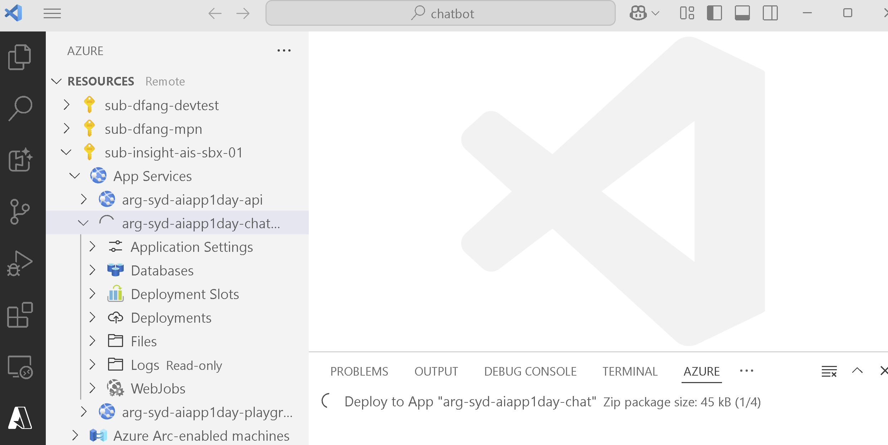

# Azure AI App In a Day Hackathon

## Provision Azure Resources

### Run bicep deployment locally

- go to labs\02-lab-02\1-azure-deployment
- modify azuredeploy.parameters.json to give resources a good name. e.g. arg-syd-aiapp1day
- modify deploy-core.ps1
- sub for demo sub: 9df3a442-42f1-40dd-8547-958c3e01597a
- rg is in this format, change suffix if needed. replace all placeholders : arg-syd-aiapp1day-anko
- run the commands in deploy-core.ps1 one by one to create azure resources

### Update the shared configuration details in guide

- AzureOpenAI apikey: the apikey is same for all models. look up the old apikey in the document, search and replace all in the vs code.
- mongodb connection string: only need to replace the host name part. search and replace all in the vs code.

## Deploy the Apps

### Deploy 3 node Node.js apps

- check the .env file and update with new keys and urls.
- Playground app `apps\playground`: no config change needed. use vs code to publish the site. 
- API app `apps\api`: replace .env values (follow .env.demo). use vs code to publish the site. 
- Chatbot app `apps\chatbot`: replace .env values, point to API app url. use vs code to publish the site. 

### Test out the 3 websites once deployed

- playground: enter apikey and chat is working. https://arg-syd-aiapp1day-playground.azurewebsites.net
- api: check swagger endpoint is working. https://arg-syd-aiapp1day-api.azurewebsites.net/docs
- chatbot: check chat is working. https://arg-syd-aiapp1day-chat.azurewebsites.net
- if any of them not working, check the deployment log tab in the azure portal.
- the first time deployment could take long for orxy to restore all the packages

## Create Dataset

### Populate data to mongodb

- use db name as aiapp1day_demo
- go through the setup steps
- follow below steps to run completed scripts, basically follow lab2 part 2 & 3
- once done, the chatbot should be able to answer sku questions

### Scripts to run

- labs\02-LAB-02\2-Load-Data\completed> npm install
- labs\02-LAB-02\2-Load-Data\completed> node .\convert.js
- labs\02-LAB-02\2-Load-Data\completed> node .\import.js
- labs\02-LAB-02\2-Load-Data\completed> npm install
- labs\02-LAB-02\3-Vector-Search\completed> node .\vectorize.js

