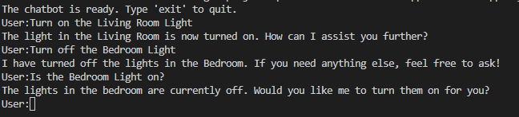

# Coding Challenge

In the earlier modules, you learned how to interact with OpenAI models using Azure OpenAI Service. And try different prompts and get the desired output. In this section you will be applying the concepts learned to solve the code challenge below.

## Create Home Automation Chatbot

### Problem Statement

You have a home automation system that controls the lights in your home. You want to build a chatbot that can automate the lights in your home using the Azure OpenAI Service. Here are the requirements for the chatbot:

1. The chatbot should be able to turn on and off the lights in your home. Let us assume that you have three lights in your home: `Living Room Light`, `Bedroom Light`, and `Kitchen Light`.
2. The chatbot should be able to help you with the status of the lights in your home.
3. You should be able to communicate with the chatbot using natural language. Some of the examples are:
   - "Turn on the Living Room Light"
   - "Turn off the Bedroom Light"
   - "Is the Bedroom Light on?"

Create a simple Node.js application that prints the response from the chatbot to the console window.

Hint: Use [chat tools](https://learn.microsoft.com/en-us/javascript/api/overview/azure/openai-readme?view=azure-node-preview#use-chat-tools) to turn on and off the lights in your home.

The completed code is available in the `labs/01-Lab-01/8-Exercise` folder.

Open terminal window in VS code, and run below command to start the application.

```bash
npm install
node app.js
```

This will run the Node.js application and ask you to enter the command to interact with the chatbot. Some sample responses are provided below:


