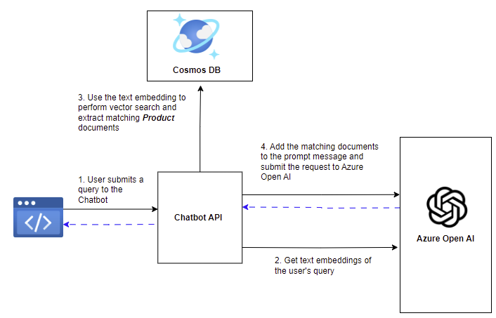

:::info LAB PRE-REQUISITES

- VS Code
- Node.js 18.x or later
- Azure OpenAI API Key
- Access to Azure Cosmos DB

  :::

## Introduction

For this lab, you will be building a chatbot for a bicycle store that can answer queries about bicycles and accessories.

The product catalog for the bicycle store is stored in Azure Cosmos DB database. The chatbot will use Azure Cosmos DB vector search capabilities to retrieve relevant documents from the database based on the user's query.

The Chatbot application will use the retrieved documents to generate the final response using Chat Completion API from Azure OpenAI.

## Lab Outline

1. [Azure Deployment Guide](/02-Part-2-Building-Chatbot/1-Azure-Deployment.md): **The Azure resources required for this lab have already been provisioned for you.** If you would like to provision the resources on your own subscription, follow the instructions on the [Azure Deployment Guide](/02-Part-2-Building-Chatbot/1-Azure-Deployment.md) page.

2. [Loading Product Catalog](/02-Part-2-Building-Chatbot/2-Load-Product-Catalog.md): The first step in building the chatbot is to load some sample data into the Azure Cosmos DB database to build a product catalog.

3. [Vector Search with Azure Cosmos DB](/02-Part-2-Building-Chatbot/3-Vector-Search.md): Use text embeddings to perform vector search in Azure Cosmos DB.

4. [Workflow Orchestration using LangChain](/02-Part-2-Building-Chatbot/4-Using-Langchain.md): Use LangChain to orchestrate the workflow of querying Azure Cosmos DB and Azure OpenAI services.

5. [Chatbot Backend API](/02-Part-2-Building-Chatbot/5-Chatbot-Backend.md): Build the Node.js backend API to expose the chatbot functionality.

6. [Chatbot Frontend](/02-Part-2-Building-Chatbot/6-Chatbot-Frontend.md): Connect the Chatbot Frontend with the Backend API.

## Deployment Architecture

The Front-end Web App is a static SPA application written in React. Since React is outside the scope of this guide, the source code for the Front-end Web App is provided for you. The Front-end Web App communicates with the Node.js backend API, which you will build in this lab.

The Node.js backend API is responsible for generating responses to user queries. It queries Azure Cosmos DB to extract relevant documents using vector search and then uses Azure OpenAI services to generate responses to user queries.
