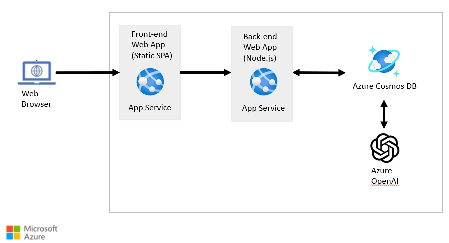

:::info LAB PRE-REQUISITES

- VS Code
- Node.js 18.x or later
- Azure OpenAI API Key
- Access to Azure Cosmos DB

  :::

## Introduction

For this lab, you will be building a chatbot that uses Azure Cosmos DB for MongoDB's vector search capabilities and Azure OpenAI services to create a conversational experience. The chatbot will be able to retrieve documents from Azure Cosmos DB using vector search and provide responses to user queries using Azure OpenAI services.

## Architecture Overview

The Front-end Web App is a static SPA application written in React. Since React is outside the scope of this guide, the source code for the Front-end Web App is provided for you. The Front-end Web App communicates with the Node.js backend API, which you will build in this lab.

The Node.js backend API is responsible for generating responses to user queries. It queries Azure Cosmos DB to extract relevant documents using vector search and then uses Azure OpenAI services to generate responses to user queries.

## Provision Azure resources (Optional)

:::info

The Azure resources required for this lab have already been provisioned for you.

:::

If you would like to provision the resources yourself, follow the instructions on the `Azure Deployment Guide` page.

