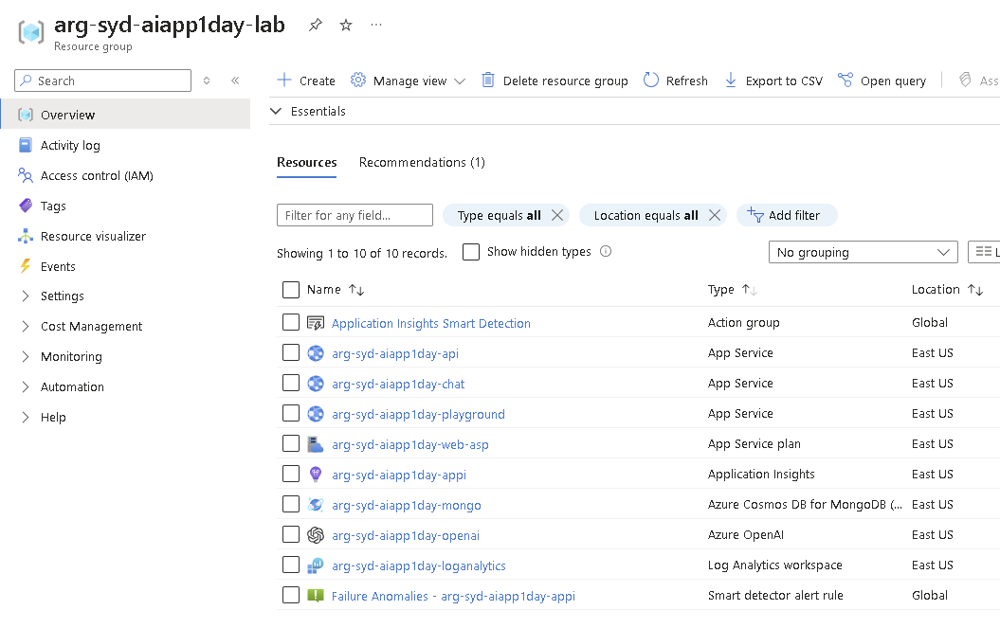
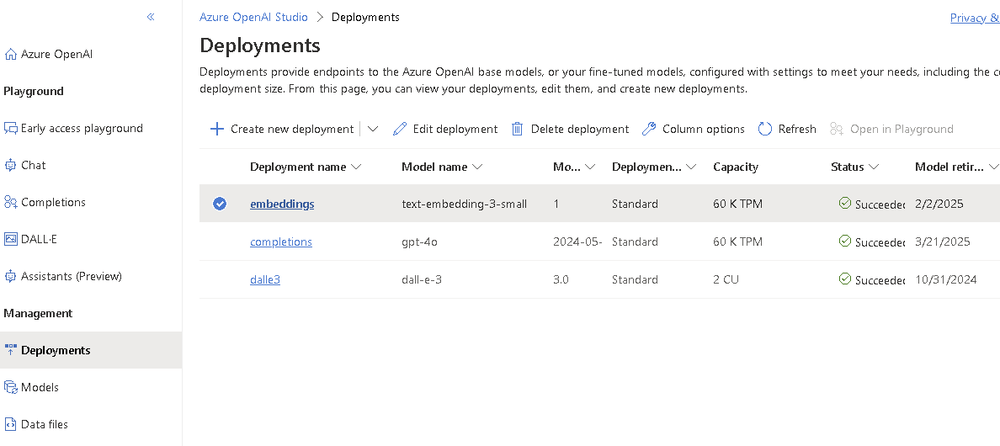

# Azure Deployment Guide

This Azure Deployment using Bicep step is optional. You can use shared keys and connection string. If you are interested to create all the resources for the labs yourself, please continue the steps on this page. Otherwise, you can go to next lab.

- Option 1: If you don't have Azure Subscription, you can use our shared lab resources. Please skip this page.
- Option 2: If you have limited Azure Subscription permission, you can deploy `App Service Only` and use the shared OpenAI service.
- Option 3: If you are Owner or Contributor of Azure Subscription and approved Azure OpenAI access, you can deploy `all resources` and use them.


## Option 1: Use shared lab resources

Please continue to next lab. We will demostrate the Bicep deployment.


## Option 2: Deploy App Service Only

This deployment will only create 2 web apps for the Chatbot Frontend and Backend.

### Run Deployment

Open a terminal and navigate to `labs/02-LAB-02/1-Azure-Deployment/lab-user` folder within the repository.

1. Login

   ```Powershell
   az login
   ```

2. Set the desired subscription (Optional). If you have more than one subscription associated with your account, set the desired subscription using the following command:

   ```Powershell
   az account set --subscription <subscription-id>
   ```

3. Create resource group, replace \{your-rg-name\} with the resource group name you like, could be aiapp1day-daniel-rg.

   ```Powershell
   az group create --name {your-rg-name} --location eastus
   ```

4. Do a What-If test deployment first

   ```Powershell
   az deployment group create --resource-group {your-rg-name}-rg --template-file ./azuredeploy.bicep --parameters ./azuredeploy.parameters.json --what-if
   ```

5. Deploy the solution resources using the following command (this will take a few minutes to run):

   ```Powershell
   az deployment group create --resource-group {your-rg-name}-rg --template-file ./azuredeploy.bicep --parameters ./azuredeploy.parameters.json
   ```

6. Go to `Resource Group`'s `Deployments` tab to check progress in the Azure Portal.


## Option 3: Deploy All Resources

This deployment will create all the resources required for the lab, including Azure OpenAI service, Azure Cosmos DB, and Azure App Services for the Chatbot Frontend and Backend.

### Prerequisites

- Azure subscription (Owner or Contributor)
- [Azure Cli](https://learn.microsoft.com/en-us/cli/azure/install-azure-cli) (Azure Cli includes Bicep)
- Access to Azure OpenAI service

### Configure Deployment

Open a terminal and navigate to `labs/02-LAB-02/1-Azure-Deployment/lab-core` folder within the repository.

Open the `azuredeploy.parameters.json` file, edit the `name` (it will be the prefix of all resources). e.g.: arg-syd-daniel

Then edit the `mongoDbPassword` to a password you wish to use for the MongoDB Admin User. When the Azure Bicep template is deployed, this parameters file will be used to configure the Mongo DB Password and other parameters when provisioning the Azure resources.


### Run Deployment

Open a terminal window and log in to Azure using the following command:

1. Login

   ```Powershell
   az login
   ```

2. Set the desired subscription (Optional). If you have more than one subscription associated with your account, set the desired subscription using the following command:

   ```Powershell
   az account set --subscription <subscription-id>
   ```

3. Create resource group, replace \{your-rg-name\} with the resource group name you like, could be aiapp1day-daniel-rg.

   ```Powershell
   az group create --name {your-rg-name} --location eastus
   ```

4. Do a What-If test deployment first

   ```Powershell
   az deployment group create --resource-group {your-rg-name}-rg --template-file ./azuredeploy.bicep --parameters ./azuredeploy.parameters.json --what-if
   ```

5. Deploy the solution resources using the following command (this will take a few minutes to run):

   ```Powershell
   az deployment group create --resource-group {your-rg-name}-rg --template-file ./azuredeploy.bicep --parameters ./azuredeploy.parameters.json
   ```

6. Go to `Resource Group`'s `Deployments` tab to check progress in the Azure Portal.


## Deployed Azure Resources

### Azure Resource List

    

### Azure OpenAI Models

    
