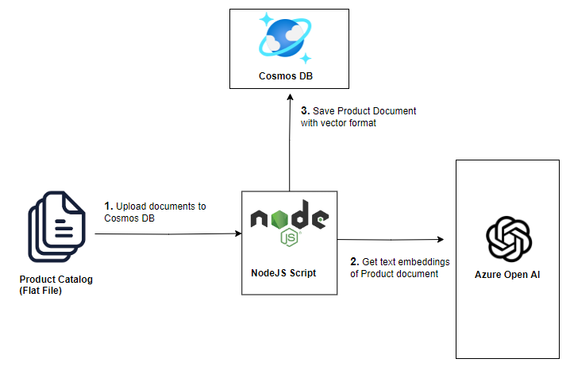

# Load Product Catalog

:::tip Azure Cosmos DB

Azure Cosmos DB is a globally distributed, multi-model database service for any scale. The Azure Cosmos DB for MongoDB supports Vector Search, which allows you to search for documents based on their similarity to a query document.

:::

In this lab, you will load the product catalog data into Azure Cosmos DB. The product catalog will be used by the chatbot to answer questions related to the products in the catalog.

The product catalog data is shared in a CSV file. You will be writing a custom script to convert the CSV file to JSON format and then load the JSON data into the Cosmos DB.



## Setup the lab environment

1. Navigate to the lab folder `~/labs/02-LAB-02/2-Load-Data/start` within the repository.

   ```bash
   cd  labs/02-LAB-02/2-Load-Data/start
   code .
   ```

:::info
The `~/labs/02-LAB-02/2-Load-Data/completed` folder contains the completed solution for this lab.
:::

2. In the lab folder, edit a `.env` file and set the following environment variables, replace `<MONGODB_CONNECTION_STRING>` with your Cosmos DB service connection string:

   ```text
   MONGODB_CONNECTION_STRING=mongodb+srv://<user>:<password>@<db>.mongocluster.cosmos.azure.com/?tls=true&authMechanism=SCRAM-SHA-256&retrywrites=false&maxIdleTimeMS=120000
   ```

3. Choose a unique name for your CosmosDB database, modify `MONGODB_Name` in `.env` file. Everyone in the hackathon will share the same CosmosDB instance (unless you have deployed your own Azure resources)

   ```text
   MONGODB_Name = 'aiapp1day_daniel_55'

   MONGODB_Name = 'aiapp1day_{your_name}_{your_lucky_number}'
   ```

4. In Visual Studio Code, open a terminal window and navigate to `start` folder.

5. To install the required packages, execute the following command in the terminal window:

   ```bash
   npm install
   ```

## Prepare the data set

The quality of the dataset feeding into the LLM model makes a big difference. While it is typically the responsibility of the data team, there may be various conversions and integrations required to format the dataset. Let's take a look at the product dataset and see if any modifications are needed before loading it into Cosmos DB.

The `product` data set is located in the `data\product.csv` file. It has the following fields: `id`,`categoryId`,`categoryName`,`sku`,`name`,`description`,`price`,`tags`. The `tags` field is a JSON array of strings.

1. Here is a snapshot of the `product.csv` file:

   

2. The first step is to convert the CSV file to JSON format. Open the `convert.js` file and paste the following code. This will parse the CSV file and generate `product.json` file with the data.

   ```javascript
   const fs = require("fs");
   const path = require("path");
   const rootDir = "data";

   // Read CSV file
   const csvFilePath = path.join(rootDir, "product.csv");
   const csvData = fs.readFileSync(csvFilePath, "utf8");

   // Convert CSV to JSON
   function csvToJson(csv) {
     const lines = csv.trim().split("\n");
     const headers = lines[0]
       .split(",")
       .map((header) => header.replace(/"/g, ""));
     const jsonData = lines.slice(1).map((line) => {
       const values = line
         .split(/,(?=(?:(?:[^"]*"){2})*[^"]*$)/)
         .map((value) => value.replace(/"/g, ""));
       const obj = {};
       headers.forEach((header, index) => {
         if (header === "tags") {
           // Decode the JSON string
           obj[header] = JSON.parse(values[index].replace(/'/g, '"'));
         } else {
           obj[header] = values[index];
         }
       });
       return obj;
     });
     return JSON.stringify(jsonData, null, 2);
   }

   const json = csvToJson(csvData);

   // Write JSON to file
   const jsonFilePath = path.join(rootDir, "product.json");
   fs.writeFileSync(jsonFilePath, json, "utf8");

   console.log("CSV file has been converted to JSON file successfully.");
   ```

3. Save the `convert.js` file. Run the following command in the terminal window to execute the script:

   ```bash
   node convert.js
   ```

4. Open the generated `product.json` file and see if any format issues stands out?
   

5. It seems `price` field is a string rather than float. The datatype is important, Lets correct it.

6. To convert the price tag to a float in the JSON file, modify the code as follows:

   ```javascript
   if (header === "tags") {
     // Decode the JSON string
     obj[header] = JSON.parse(values[index].replace(/'/g, '"'));
   } else if (header === "price") {
     // Convert price to integer
     obj[header] = parseFloat(values[index], 10);
   } else {
     obj[header] = values[index];
   }
   ```

7. Execute the code again and compare the two JSON files once more. It appears that the description field is missing quotation marks in some parts still.

   :::note
   Can you suggest a modification to the code that would preserve the quotation marks in the description field?
   :::

## Bulk load product data

There are multiple options available for performing bulk operations in Cosmos DB. In this section, we will focus on using the `bulkWrite` method. The `bulkWrite` method allows you to execute multiple write operations in a single batch, including insert, update, and delete operations.

1. Open the `import.js` file, and add the following code after the code block `const db = client.db(process.env.MONGODB_NAME);`.

   This will read the `product.json` file and load the data into the `productRawData` variable. The database collection for `product` is also initialized. Note that MongoDB will create the collections if they do not already exist.

   ```javascript
   // Load product data
   console.log("Loading product data");
   // Initialize the product collection pointer (will automatically be created if it doesn't exist)
   const productCollection = db.collection("products");

   // Define the path to the local JSON file
   const jsonFilePath = path.join("data", "product.json");

   // Read the JSON file
   const productRawData = fs.readFileSync(
     path.join("data", "product.json"),
     "utf8"
   );
   const productData = JSON.parse(productRawData).map((prod) =>
     cleanData(prod)
   );
   ```

2. You may run the upload script multiple times, which will result in duplicate data. To avoid having duplicate data, add the following code to delete any existing products before loading the new data:

   ```javascript
   // Delete any existing products
   console.log("Deleting existing products");
   await productCollection.deleteMany({});
   ```

3. Append the following code to the previous code block to load the product data into the collection using the `bulkWrite` method:

   ```javascript
   var result = await productCollection.bulkWrite(
     productData.map((product) => ({
       insertOne: {
         document: product,
       },
     }))
   );
   console.log(`${result.insertedCount} products inserted`);
   ```

4. Save the `import.js` file.

5. Run the application by executing the following command in the terminal window:

   ```bash
   node import.js
   ```

   

   :::tip
   We reduced the total products in the data set from 295 to only 49 in the end. Do you know why?
   :::

## Bulk load of customer and sales data

The `Customer` and `Sales` data is in the `custSalesData.json` file. We will be splitting the data into two collections, `customers` and `sales`, and loading them into Cosmos DB.

1. Open the `import.js` file, and add the following code next to the previous code block. This will read the `custSalesData.json` file and load the data into the `custSaledData` variable.

   The database collections for `customers` and `sales` are also initialized.

   ```javascript
   // Load customer and sales data
   console.log("Retrieving combined Customer/Sales data");
   const customerCollection = db.collection("customers");
   const salesCollection = db.collection("sales");

   const custSalesRawData = fs.readFileSync(
     path.join("data", "custSalesData.json"),
     "utf8"
   );
   const custSalesData = JSON.parse(custSalesRawData).map((custSales) =>
     cleanData(custSales)
   );
   ```

2. Add the following code to split the `custSalesData` into `customer` and `sales` data:

   ```javascript
   console.log("Split customer and sales data");
   const customerData = custSalesData.filter(
     (cust) => cust["type"] === "customer"
   );
   const salesData = custSalesData.filter(
     (sales) => sales["type"] === "salesOrder"
   );
   ```

3. Add the following code to load the customer data into the collection using the `insertMany` method:

   ```javascript
   console.log("Loading customer data");
   await customerCollection.deleteMany({});
   result = await customerCollection.insertMany(customerData);
   console.log(`${result.insertedCount} customers inserted`);
   ```

4. Add the following code to load the sales data into the collection using the `insertMany` method:

   ```javascript
   console.log("Loading sales data");
   await salesCollection.deleteMany({});
   result = await salesCollection.insertMany(salesData);
   console.log(`${result.insertedCount} sales inserted`);
   ```

5. Save the `import.js` file.

6. Run the application by executing the following command in the terminal window:

   ```bash
   node import.js
   ```

   

## Browse the data in the Cosmos DB

1. Install MongoDb extension in VS code : `MongoDB for VS code`

   

2. Add a connection to the data.

   

3. Browse the json records in the product and customer table.

   

In this section, we used bulk load operations to load `product`, `customer`, and `sales` data into Cosmos DB. We also had to cleanup the data before loading it into the database. In the next section, we will convert the data into embeddings and perform vector search on the data.
