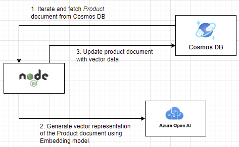

# Load Product Catalog

:::tip Azure Cosmos DB

Azure Cosmos DB is a globally distributed, multi-model database service for any scale. The Azure Cosmos DB for MongoDB supports Vector Search, which allows you to search for documents based on their similarity to a query document.

:::

In this lab, you will load the product catalog data into Azure Cosmos DB. The product catalog will be used by the chatbot to answer questions related to the products in the catalog.

The product catalog data is shared in a CSV file. You will be writing a custom script to convert the CSV file to JSON format and then load the JSON data into the Cosmos DB.



## Setup the lab environment

1. Navigate to the lab folder `~/labs/02-LAB-02/2-Load-Data/start` within the repository.

   ```bash
   cd  labs/02-LAB-02/2-Load-Data/start
   code .
   ```

:::info
The `~/labs/02-LAB-02/2-Load-Data/completed` folder contains the completed solution for this lab.
:::

2. In the lab folder, edit a `.env` file and set the following environment variables, replace `<MONGODB_CONNECTION_STRING>` with your Cosmos DB service connection string:

   ```text
   MONGODB_CONNECTION_STRING=mongodb+srv://<user>:<password>@<db>.mongocluster.cosmos.azure.com/?tls=true&authMechanism=SCRAM-SHA-256&retrywrites=false&maxIdleTimeMS=120000
   ```

3. Choose a unique name for your CosmosDB database, modify `MONGODB_Name` in `.env` file. Everyone in the hackathon will share the same CosmosDB instance (unless you have deployed your own Azure resources)

   ```text
   MONGODB_Name = 'aiapp1day_daniel_55'

   MONGODB_Name = 'aiapp1day_{your_name}_{your_lucky_number}'
   ```

4. In Visual Studio Code, open a terminal window and navigate to `start` folder.

5. To install the required packages, execute the following command in the terminal window:

   ```bash
   npm install
   ```

## Prepare the data set

The quality of the dataset feeding into the LLM model makes a big difference. While it is typically the responsibility of the data team, there may be various conversions and integrations required to format the dataset. Let's quickly exercise on preparing the dataset to ensure we avoid the "Rubbish in & Rubbish out" scenario for our chatbot.

The `product` data set is located in the `data\product.csv` file. It consists of multiple columns, and the `tags` column contains a JSON string.

1. This is the csv file, please the file and take a good look.
   

2. Open the `convert.js` file and paste the following code to parse the text into JSON format for better vector search.

   ```javascript
   const fs = require("fs");
   const path = require("path");
   const rootDir = "data";

   // Read CSV file
   const csvFilePath = path.join(rootDir, "product.csv");
   const csvData = fs.readFileSync(csvFilePath, "utf8");

   // Convert CSV to JSON
   function csvToJson(csv) {
     const lines = csv.trim().split("\n");
     const headers = lines[0]
       .split(",")
       .map((header) => header.replace(/"/g, ""));
     const jsonData = lines.slice(1).map((line) => {
       const values = line
         .split(/,(?=(?:(?:[^"]*"){2})*[^"]*$)/)
         .map((value) => value.replace(/"/g, ""));
       const obj = {};
       headers.forEach((header, index) => {
         if (header === "tags") {
           // Decode the JSON string
           obj[header] = JSON.parse(values[index].replace(/'/g, '"'));
         } else {
           obj[header] = values[index];
         }
       });
       return obj;
     });
     return JSON.stringify(jsonData, null, 2);
   }

   const json = csvToJson(csvData);

   // Write JSON to file
   const jsonFilePath = path.join(rootDir, "product.json");
   fs.writeFileSync(jsonFilePath, json, "utf8");

   console.log("CSV file has been converted to JSON file successfully.");
   ```

3. Save the `convert.js` file. To run the application, execute the following command in the terminal window:

   ```bash
   node convert.js
   ```

4. Open the generated `product.json` file and see if any format issues stands out?
   

5. Use the `Differ` feature in Visual Studio Code to compare `product.json` and `product-original.json` (the ideal format) for any discrepancies. The `price` field is a string rather than float.

6. To convert the price tag to a float in the JSON file, modify the code as follows:

   ```javascript
   if (header === "tags") {
     // Decode the JSON string
     obj[header] = JSON.parse(values[index].replace(/'/g, '"'));
   } else if (header === "price") {
     // Convert price to integer
     obj[header] = parseFloat(values[index], 10);
   } else {
     obj[header] = values[index];
   }
   ```

7. Execute the code again and compare the two JSON files once more. It appears that the description field is missing quotation marks in some parts still.

   :::note
   Can you suggest a modification to the code that would preserve the quotation marks in the description field?
   :::

## Bulk load product data

There is more than one option when performing bulk operations in Cosmos DB. In this section, data will be loaded using the `bulkWrite` method. The `bulkWrite` method is used to perform multiple write operations in a single batch, write operations can include a mixture of insert, update, and delete operations.

1. Open the `import.js` file, and directly beneath the `const db = client.db(process.env.MONGODB_NAME);` line, add the following code to fetch the product data from the Contoso Bike Store repository:

   ```javascript
   // Load product data
   console.log("Loading product data");
   // Initialize the product collection pointer (will automatically be created if it doesn't exist)
   const productCollection = db.collection("products");

   // Define the path to the local JSON file
   const jsonFilePath = path.join("data", "product.json");

   // Read the JSON file
   const productRawData = fs.readFileSync(
     path.join("data", "product.json"),
     "utf8"
   );
   const productData = JSON.parse(productRawData).map((prod) =>
     cleanData(prod)
   );
   ```

2. Optionally, append the following code (to the code in the previous step) to delete any existing products in the collection. This helps if the application is run multiple times so there is no duplicates.

   ```javascript
   // Delete any existing products
   console.log("Deleting existing products");
   await productCollection.deleteMany({});
   ```

3. Append the following code (to the code in the previous step) to bulk load the product data into the collection:

   ```javascript
   var result = await productCollection.bulkWrite(
     productData.map((product) => ({
       insertOne: {
         document: product,
       },
     }))
   );
   console.log(`${result.insertedCount} products inserted`);
   ```

4. Save the `import.js` file.

5. Run the application by executing the following command in the terminal window:

   ```bash
   node import.js
   ```

   

   :::tip
   We reduced the total products in the data set from 295 to only 49 in the end. Do you know why?
   :::

## Bulk load of customer and sales data

`Customer` data and `sales` data are also combined in a single JSON source, some pre-processing is required to separate the data into two separate collections.

1. Open the `import.js` file, and directly beneath the code for adding products, append the following code to fetch the customer and sales data from the Contoso Bike Store repository:

   ```javascript
   // Load customer and sales data
   console.log("Retrieving combined Customer/Sales data");
   const customerCollection = db.collection("customers");
   const salesCollection = db.collection("sales");

   const custSalesRawData = fs.readFileSync(
     path.join("data", "custSalesData.json"),
     "utf8"
   );
   const custSalesData = JSON.parse(custSalesRawData).map((custSales) =>
     cleanData(custSales)
   );
   ```

2. Split the customer data from the sales data by appending the following code (to the code in the previous step):

   ```javascript
   console.log("Split customer and sales data");
   const customerData = custSalesData.filter(
     (cust) => cust["type"] === "customer"
   );
   const salesData = custSalesData.filter(
     (sales) => sales["type"] === "salesOrder"
   );
   ```

3. Append the following code (to the code in the previous step) to bulk load the customer data into the collection using the `insertMany` method:

   ```javascript
   console.log("Loading customer data");
   await customerCollection.deleteMany({});
   result = await customerCollection.insertMany(customerData);
   console.log(`${result.insertedCount} customers inserted`);
   ```

4. Append the following code (to the code in the previous step) to bulk load the sales data into the collection using the `insertMany` method:

   ```javascript
   console.log("Loading sales data");
   await salesCollection.deleteMany({});
   result = await salesCollection.insertMany(salesData);
   console.log(`${result.insertedCount} sales inserted`);
   ```

5. Save the `import.js` file.

6. Run the application by executing the following command in the terminal window:

   ```bash
   node import.js
   ```

   

## Browse the data in the Cosmos DB

1. Install MongoDb extension in VS code : `MongoDB for VS code`

   

2. Add a connection to the data.

   

3. Browse the json records in the product and customer table.

   

In this section, bulk load operations were used to load `product`, `customer`, and `sales` data into Cosmos DB. We need to process the dataset and perform data engineering tasks to ensure the data is of high quality, which will lead to better results in vector search and LLM outcomes.
