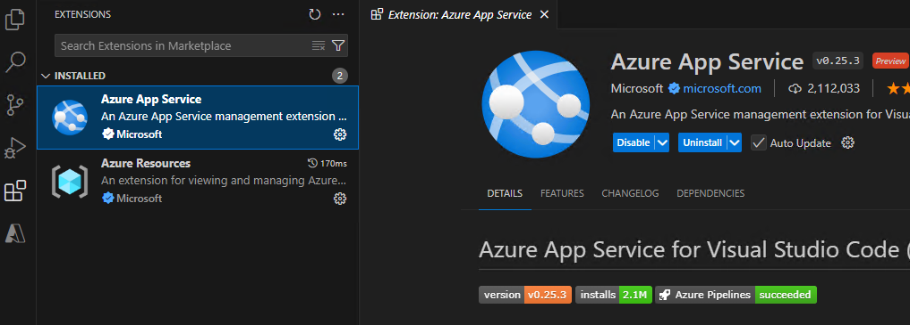
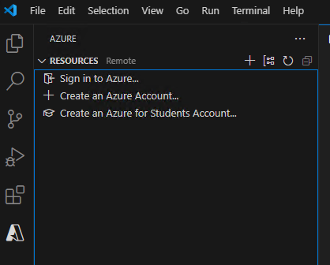
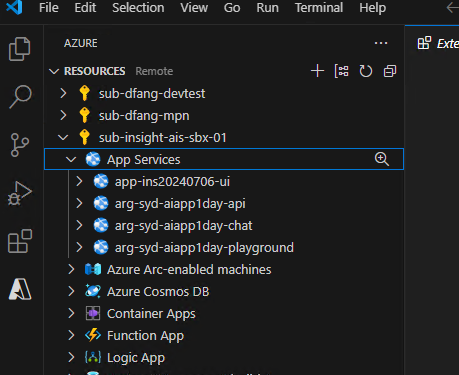
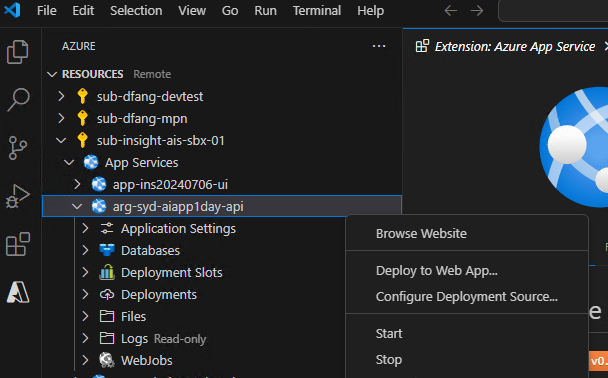
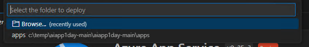
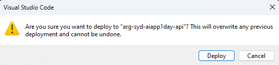
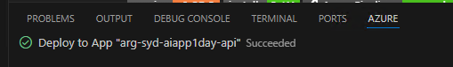
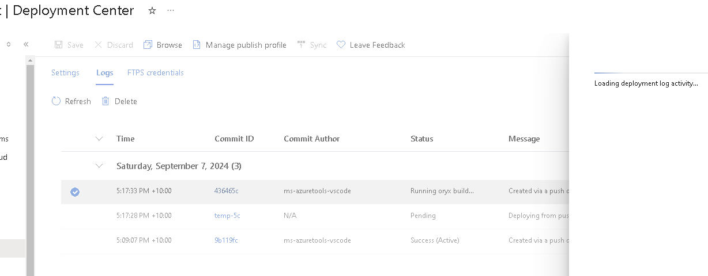

# App Deployment

Let's now deploy Chatbot FrontEnd and BackEnd to Azure App Service.

:::info
In order to deploy the Chatbot to Azure, you need to have 2 `App Services`. Go back to `Azure Deployment` step and follow `Option 2: Deploy App Service Only` to create resources if you skip the step earlier.
:::

## Deploy Chatbot BackEnd API to Azure App Service

1. Open repo in VS code.

2. Install `Azure App Service` extension in Vs Code. If you are using GitHub Codespaces, extension is already installed.

   

3. Sign in to Azure in the Azure tab

   

4. Expand `App Services` node in your `Subscription`

   

5. Right click `App Service` name and select 'Deploy to Web App..`

   

6. Select Browse in the dropdownlist and locate `apps\api` folder and click ok.

   

7. Select `Deploy` if below popup shows. Check the progress in VS Code's `Azure` tab

   

8. Once completed, you can find api app url in your Azure Portal under the `App Service`

   

   :::info
   The VS Code deployment only uploads code to `App Service`, there will be additional build activity running in the server side. Check progress in `Deployment Center`.

   
   :::

9. Open the Url in browser and add path `\docs` to access the swagger. for example: https://arg-syd-aiapp1day-api.azurewebsites.net/docs


## Deploy Chatbot FrontEnd to Azure App Service


1. Update frontend chatbot's `BACKEND_URI` in `apps\chatbot\.env` file. Replace the `BACKEND_URI` with the actual Azure App service url of backend from last step, similar to below.

   ```
   BACKEND_URI=https://arg-syd-aiapp1day-api.azurewebsites.net
   ```

2. Repeat above steps and deploy `apps\chatbot` folder

3. Once completed, you can find chatbot app url in your Azure Portal under the `App Service`. for example, https://arg-syd-aiapp1day-chat.azurewebsites.net/

4. Open the chatbot url in your browser and try out the prompts.

   :::info
   If you see an error in the chatbot, switch to `developer tools` in the browser. Check if you have the backend API url configured correctly.
   :::

5. Now, you have deployed your chatbot to Azure! Congrat !!

   :::info
   Forget to mention, there would also be a CORS error. Please try and find the commented line that configures CORS in the API. :p
   :::

5. Now, you have **successfully** deployed your chatbot to Azure! Congrat !!
