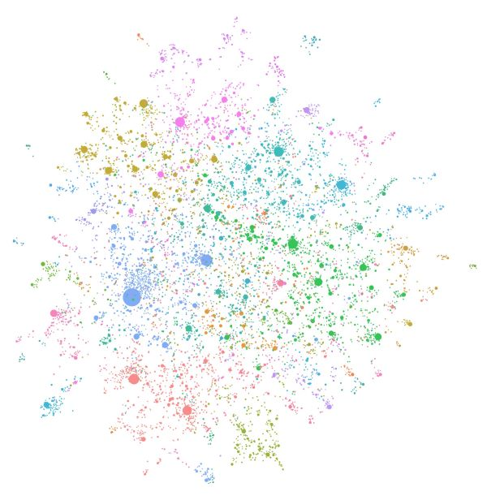

## Introduction

GraphRAG is a structured, hierarchical approach to Retrieval Augmented Generation (RAG), as opposed to naive semantic-search approaches using plain text snippets. The GraphRAG process involves extracting a knowledge graph out of raw text, building a community hierarchy, generating summaries for these communities, and then leveraging these structures when perform RAG-based tasks.

To learn more about GraphRAG and how it can be used to enhance your language model's ability to reason about your private data, please visit the Microsoft Research Blog Post.

## GraphRAG vs Baseline RAG 🔍

Retrieval-Augmented Generation (RAG) is a technique to improve LLM outputs using real-world information. This technique is an important part of most LLM-based tools and the majority of RAG approaches use vector similarity as the search technique, which we call Baseline RAG. GraphRAG uses knowledge graphs to provide substantial improvements in question-and-answer performance when reasoning about complex information. RAG techniques have shown promise in helping LLMs to reason about private datasets - data that the LLM is not trained on and has never seen before, such as an enterprise’s proprietary research, business documents, or communications. Baseline RAG was created to help solve this problem, but we observe situations where baseline RAG performs very poorly. For example:

- Baseline RAG struggles to connect the dots. This happens when answering a question requires traversing disparate pieces of information through their shared attributes in order to provide new synthesized insights.
- Baseline RAG performs poorly when being asked to holistically understand summarized semantic concepts over large data collections or even singular large documents.

To address this, the tech community is working to develop methods that extend and enhance RAG. Microsoft Research’s new approach, GraphRAG, creates a knowledge graph based on an input corpus. This graph, along with community summaries and graph machine learning outputs, are used to augment prompts at query time. GraphRAG shows substantial improvement in answering the two classes of questions described above, demonstrating intelligence or mastery that outperforms other approaches previously applied to private datasets.

## The GraphRAG Process 🤖
GraphRAG builds upon our prior research and tooling using graph machine learning. The basic steps of the GraphRAG process are as follows:

### Index
- Slice up an input corpus into a series of TextUnits, which act as analyzable units for the rest of the process, and provide fine-grained references in our outputs.
- Extract all entities, relationships, and key claims from the TextUnits.
- Perform a hierarchical clustering of the graph using the Leiden technique. To see this visually, check out Figure 1 above. Each circle is an entity (e.g., a person, place, or organization), with the size representing the degree of the entity, and the color representing its community.
- Generate summaries of each community and its constituents from the bottom-up. This aids in holistic understanding of the dataset.

### Query
At query time, these structures are used to provide materials for the LLM context window when answering a question. The primary query modes are: Global Search, Local Search and DRIFT Search.

### Prompt Tuning
Using GraphRAG with your data out of the box may not yield the best possible results. We strongly recommend to fine-tune your prompts following the Prompt Tuning Guide in our documentatio

## Read More

- 👉 Graph RAG: https://microsoft.github.io/graphrag/
- 👉 Microsoft Research Blog Post: https://www.microsoft.com/en-us/research/blog/graphrag-unlocking-llm-discovery-on-narrative-private-data/
- 👉 GraphRAG Accelerator: https://github.com/Azure-Samples/graphrag-accelerator
- 👉 GraphRAG Arxiv: https://arxiv.org/pdf/2404.16130

