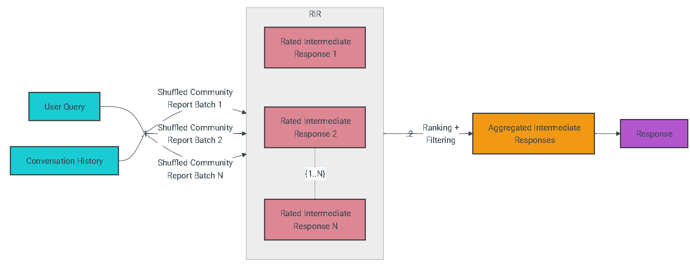
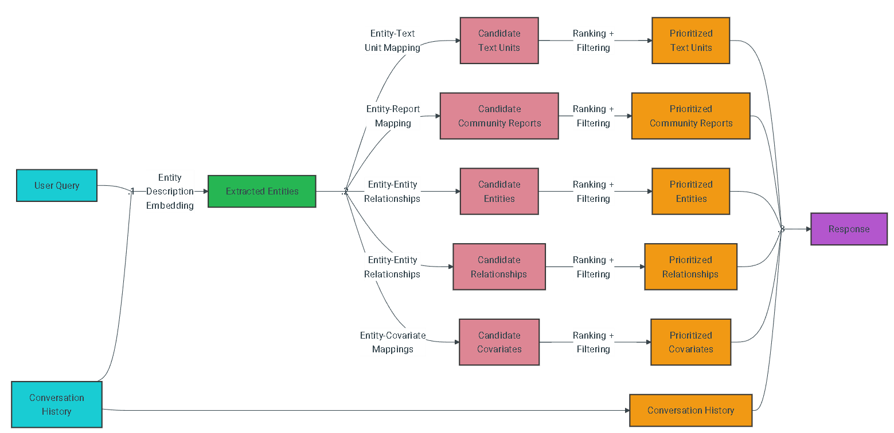
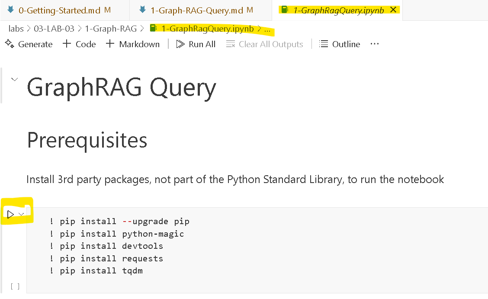
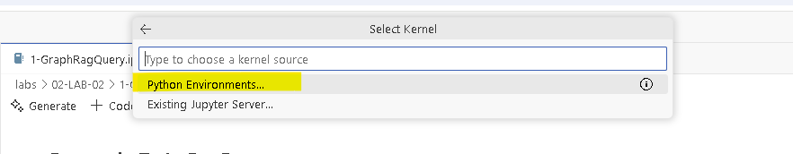
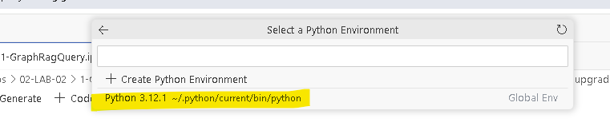
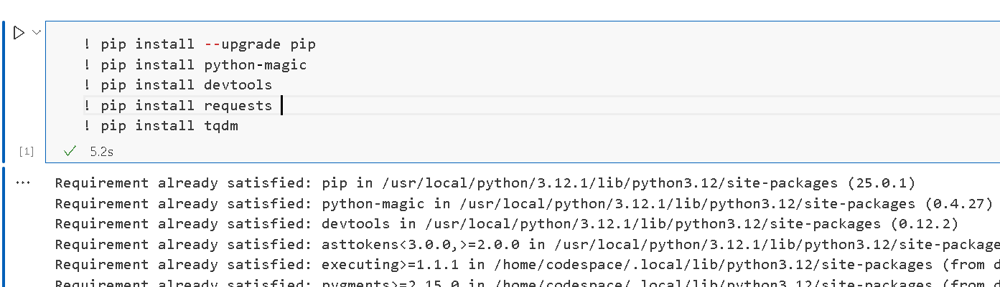

# GraphRAG Query

At query time, these structures are used to provide materials for the LLM context window when answering a question. The primary query modes are:

- Global Search for reasoning about holistic questions about the corpus by leveraging the community summaries.
- Local Search for reasoning about specific entities by fanning-out to their neighbors and associated concepts.
- DRIFT Search for reasoning about specific entities by fanning-out to their neighbors and associated concepts, but with the added context of community information.

## Global Search

### Whole Dataset Reasoning

Baseline RAG struggles with queries that require aggregation of information across the dataset to compose an answer. Queries such as “What are the top 5 themes in the data?” perform terribly because baseline RAG relies on a vector search of semantically similar text content within the dataset. There is nothing in the query to direct it to the correct information.

However, with GraphRAG we can answer such questions, because the structure of the LLM-generated knowledge graph tells us about the structure (and thus themes) of the dataset as a whole. This allows the private dataset to be organized into meaningful semantic clusters that are pre-summarized. Using our global search method, the LLM uses these clusters to summarize these themes when responding to a user query.

### Methodology

Given a user query and, optionally, the conversation history, the global search method uses a collection of LLM-generated community reports from a specified level of the graph's community hierarchy as context data to generate response in a map-reduce manner. At the map step, community reports are segmented into text chunks of pre-defined size. Each text chunk is then used to produce an intermediate response containing a list of point, each of which is accompanied by a numerical rating indicating the importance of the point. At the reduce step, a filtered set of the most important points from the intermediate responses are aggregated and used as the context to generate the final response.

The quality of the global search’s response can be heavily influenced by the level of the community hierarchy chosen for sourcing community reports. Lower hierarchy levels, with their detailed reports, tend to yield more thorough responses, but may also increase the time and LLM resources needed to generate the final response due to the volume of reports.

## Local Search

### Entity-based Reasoning

The local search method combines structured data from the knowledge graph with unstructured data from the input documents to augment the LLM context with relevant entity information at query time. It is well-suited for answering questions that require an understanding of specific entities mentioned in the input documents (e.g., “What are the healing properties of chamomile?”).

### Methodology

Given a user query and, optionally, the conversation history, the local search method identifies a set of entities from the knowledge graph that are semantically-related to the user input. These entities serve as access points into the knowledge graph, enabling the extraction of further relevant details such as connected entities, relationships, entity covariates, and community reports. Additionally, it also extracts relevant text chunks from the raw input documents that are associated with the identified entities. These candidate data sources are then prioritized and filtered to fit within a single context window of pre-defined size, which is used to generate a response to the user query.

## Try it out in Jupyter Notebook

Jupyter Notebook is used to create interactive notebook documents that can contain live code, equations, visualizations, media and other computational outputs. Jupyter Notebook is often used by programmers, data scientists and students to document and demonstrate coding workflows or simply experiment with code.

1. Go to `labs\02-LAB-02` in the VS Code `Explorer`, find the `1-Graph-RAG` folder and open `1-GraphRagQuery.ipynb`

2. The `Jupyter Notebook` will open and looks like below. Now you can follow each step and use the `play` icon to execute the steps.

3. Click the `play` icon in the first cell under `Install 3rd party packages`, VS Code will ask to select a python environment. Python and related extensions should be already installed in `codespaces`, select an existing python environment from top panel of VS Code as prompted.

4. Once installed, you can continue to carry out the rest of the exercises in the notebook. The `data` folder contains user feedback data we ingested to Graph RAG.

5. Feel free to try out different user prompt in the Graph RAG query.

