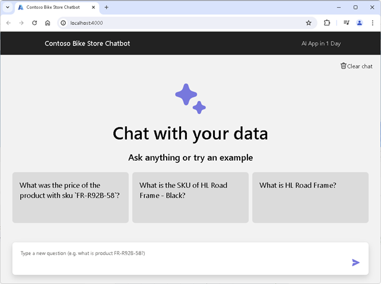
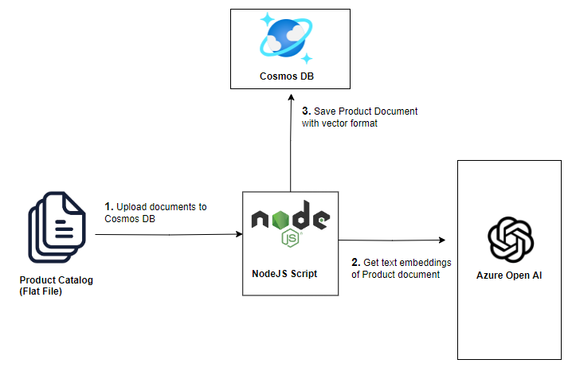
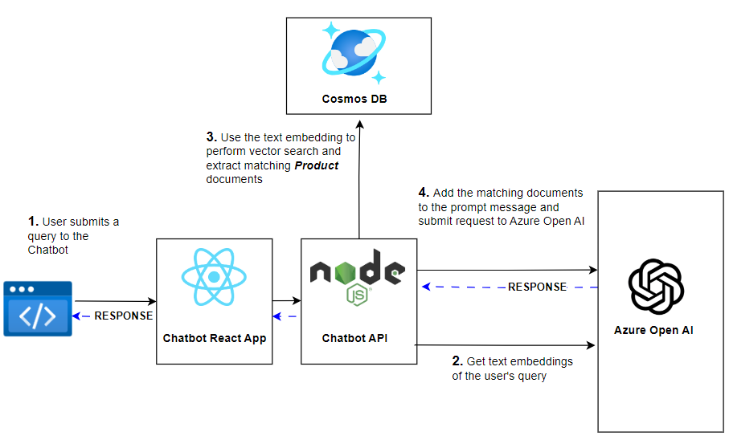
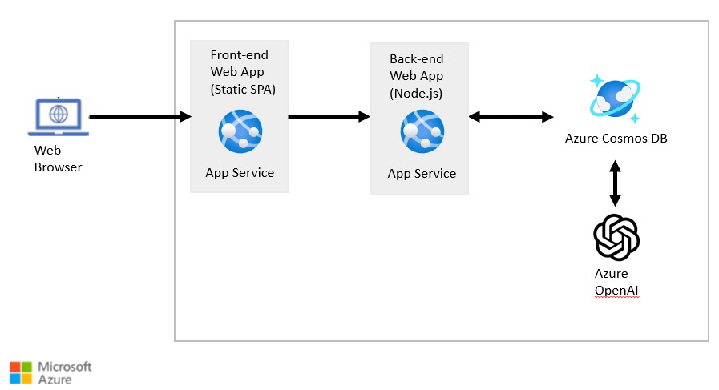

:::info LAB PRE-REQUISITES

- VS Code
- Node.js 18.x or later
- Azure OpenAI API Key
- Azure Cosmos DB

  :::

## Introduction

For this lab, you will be building a chatbot for a bicycle store that can answer queries about bicycles and accessories for you.

The coding exercises for each lab contain two folders:

| Folder      | Purpose                                                                                             |
|-------------|-----------------------------------------------------------------------------------------------------|
| `start`     | Unmodified code that is ready for you to begin the exercise. Make your changes in this folder.      |
| `completed` | Completed code for reference. Compare your changes with this folder when you complete the exercise. |

Please see the [lab outline section](#lab-outline) below for more details.

### Chatbot Demo

https://arg-syd-aiapp1day-chat.azurewebsites.net/

The product catalog for the bicycle store is stored in Azure Cosmos DB database. The solution will use Azure Cosmos DB vector search capabilities to retrieve relevant documents from the database based on the user's query. It will generate the final response using Chat Completion API from Azure OpenAI.

### Data Ingestion

### Query Processing

## Lab Outline

1. [Azure Deployment Guide](/03-Part-3-Building-Chatbot/1-Azure-Deployment.md): **The Azure resources required for this lab have already been provisioned for you.** If you would like to provision the resources on your own subscription, follow the instructions on the [Azure Deployment Guide](/03-Part-3-Building-Chatbot/1-Azure-Deployment.md) page.

2. [Loading Product Catalog](/03-Part-3-Building-Chatbot/2-Load-Product-Catalog.md): The first step in building the chatbot is to load some sample data into the Azure Cosmos DB database to build a product catalog.

3. [Vector Search with Azure Cosmos DB](/03-Part-3-Building-Chatbot/3-Vector-Search.md): Use text embeddings to perform vector search in Azure Cosmos DB.

4. [Workflow Orchestration using LangChain](/03-Part-3-Building-Chatbot/4-Using-Langchain.md): Use LangChain to orchestrate the workflow of querying Azure Cosmos DB and Azure OpenAI services.

5. [Chatbot Backend API](/03-Part-3-Building-Chatbot/5-Chatbot-Backend.md): Build the Node.js backend API to expose the Azure Open AI functionality.

6. [Chatbot Frontend](/03-Part-3-Building-Chatbot/6-Chatbot-Frontend.md): Connect Chatbot Frontend with the Backend API.

## Deployment Architecture

The Front-end Web App is a static SPA application written in React. Since React is outside the scope of this guide, the source code for the Front-end Web App is provided for you. The Front-end Web App communicates with the Node.js backend API, which you will build in this lab.

The Node.js backend API is responsible for generating responses to user queries. It queries Azure Cosmos DB to extract relevant documents using vector search and then uses Azure OpenAI services to generate responses to user queries.

Lets get started by clicking the Next button below.