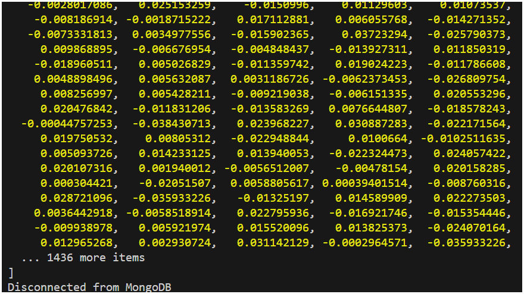
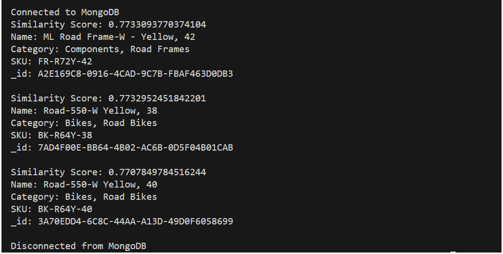

# Vector search using text embeddings

:::tip Text Embeddings
The text embeddings are a type of vector representation of data over a continuous vector space where similar items are close together and dissimilar items are far apart. This allows us to perform operations on the vectors to find similar items, perform clustering, and more.
:::

In the previous lab, you loaded the `product` catalog into Azure Cosmos DB. The Chatbot will use the product catalog to fetch the relevant products based on the user's query.
When fetching the relevant products, the chatbot application will compare the semantic similarity of the user's query with the product details. Hence the user's query and the product details need to be converted into a vector representation.

In this lab, you will learn how to use an Azure OpenAI embedding model to generate text embeddings. You will create a script to iterate over the documents in the Cosmos DB collections, and generate embeddings for each document.

You will also learn how to use the vector index to retrieve the relevant documents based on the cosine similarity of the query vector and the content vectors of the documents in the collection.

## Setup the lab environment

1. Navigate to the lab folder `~/labs/03-LAB-03/3-Vector-Search/start` in the `Terminal` window.

    ```bash
    cd  labs/03-LAB-03/3-Vector-Search/start
    ```

    :::info
    The `~/labs/03-LAB-03/3-Vector-Search/completed` folder contains the completed solution for this lab. Please use `start` folder to carry out the exercise. You can compare your code with the files in `completed` folder if your code does not run correctly.
    :::

2. Check `.env` file has correct configurations. Placeholder string should be all replaced in earlier `Lab Setup` step.

3. In Visual Studio Code, open a terminal window and navigate to the lab folder `start`.

4. Install the required packages by running the following command in the terminal window:

   ```bash
   npm install
   ```

## Create the Azure OpenAI client

1. Install the `@azure/openai` package by running the following command in the terminal window.

   ```bash
   npm install @azure/openai@1.0.0-beta.11 --save
   ```

2. This will install the package and save it as a dependency in your project's `package.json` file.
   

3. Open the `embedding.js` file in the Visual Studio Code editor.

4. Add the following code to import the Azure OpenAI client and Azure Key Credential classes at the top of the file below `const { MongoClient } = require('mongodb');` line. The code block alse creates an instance of the Azure OpenAI client afer the imports.

   ```javascript
   const { OpenAIClient, AzureKeyCredential } = require("@azure/openai");

   // set up the Azure OpenAI client
   const embeddingsDeploymentName = "embeddings";
   const completionsDeploymentName = "completions";
   const aoaiClient = new OpenAIClient(
     "https://" +
       process.env.AZURE_OPENAI_API_INSTANCE_NAME +
       ".openai.azure.com/",
     new AzureKeyCredential(process.env.AZURE_OPENAI_API_KEY)
   );
   ```

## Create a function to generate text embeddings

Vectorizing or embedding text is the process of converting text into a numerical representation. The embedding model to generate text embeddings is already deployed in Azure OpenAI. In this step you will create a function that will generate embeddings for the provided text.

1. In `embedding.js`, add the following code after the `main` function:

   ```javascript
   async function generateEmbeddings(text) {
     const embeddings = await aoaiClient.getEmbeddings(
       embeddingsDeploymentName,
       text
     );
     // Rest period to avoid rate limiting on Azure OpenAI
     await new Promise((resolve) => setTimeout(resolve, 500));
     return embeddings.data[0].embedding;
   }
   ```

2. Now call the `generateEmbeddings` function with a sample text string to test the function. Add the following code in the `main` function after the `const db = dbClient.db(dbname);` line:

   ```javascript
   console.log(await generateEmbeddings("Hello, world!"));
   ```

3. Save the `embedding.js` file.

4. Run the application and observe the vector output in the console.

   ```bash
   node embedding.js
   ```

   

:::info
Please try a different input string and see if the length of the vector array changes.

It seems that no matter how long the input string is, the return of creating embeddings with "text-embedding-ada-3" is always a vector of length 1536. Why is that?
:::

## Vectorize and store the embeddings for each document

Now that the `generateEmbeddings` function is working, the next step is to use it to generate embeddings for each document and store the embeddings in a new field (contentVector) within the same document. The process of creating a vector embedding field on each document only needs to be done once. However, if a document changes, the vector embedding field will need to be updated with an updated vector.

In this section, a function is added that will loop through each document in a collection, generate the vector embedding, and store the vector embedding in the document itself. The function takes advantage of `bulkWrite` operations to perform upserts on the existing documents in an efficient way. Lastly, the function will create a vector index (VectorSearchIndex) on the collection to enable vector search queries if it does not already exist.

<!-- :::danger
We have a lot of people doing the lab at the same time. Get in quick before rate limit is hit!
::: -->

1. In `vectorize.js`, add the following code above the last line of the file `main().catch(console.error);` (that calls the `main` function) - the code is documented inline to explain the steps taken:

   ```javascript
   async function addCollectionContentVectorField(db, collectionName) {
     const collection = db.collection(collectionName);
     const docs = await collection.find({}).limit(50).toArray();
     const bulkOperations = [];
     console.log(
       `Generating content vectors for ${docs.length} documents in ${collectionName} collection`
     );
     for (let i = 0; i < docs.length; i++) {
       const doc = docs[i];
       // do not include contentVector field in the content to be embedded
       if ("contentVector" in doc) {
         delete doc["contentVector"];
       }
       const content = JSON.stringify(doc);
       const contentVector = await generateEmbeddings(content);
       bulkOperations.push({
         updateOne: {
           filter: { _id: doc["_id"] },
           update: { $set: { contentVector: contentVector } },
           upsert: true,
         },
       });
       //output progress every 25 documents
       if ((i + 1) % 25 === 0 || i === docs.length - 1) {
         console.log(
           `Generated ${i + 1} content vectors of ${
             docs.length
           } in the ${collectionName} collection`
         );
       }
     }
     if (bulkOperations.length > 0) {
       console.log(
         `Persisting the generated content vectors in the ${collectionName} collection using bulkWrite upserts`
       );
       await collection.bulkWrite(bulkOperations);
       console.log(
         `Finished persisting the content vectors to the ${collectionName} collection`
       );
     }

     //check to see if the vector index already exists on the collection
     console.log(
       `Checking if vector index exists in the ${collectionName} collection`
     );
     const vectorIndexExists = await collection.indexExists(
       "VectorSearchIndex"
     );
     if (!vectorIndexExists) {
       await db.command({
         createIndexes: collectionName,
         indexes: [
           {
             name: "VectorSearchIndex",
             key: {
               contentVector: "cosmosSearch",
             },
             cosmosSearchOptions: {
               kind: "vector-ivf",
               numLists: 1,
               similarity: "COS",
               dimensions: 1536,
             },
           },
         ],
       });
       console.log(
         `Created vector index on contentVector field on ${collectionName} collection`
       );
     } else {
       console.log(
         `Vector index already exists on contentVector field in the ${collectionName} collection`
       );
     }
   }
   ```

2. In the `main` function, beneath the `const db = dbClient.db(dbname);` line of code, add the following code to call the new `addCollectionContentVectorField` function on the `products` collection. We do the same for creating the vector embeddings for the `customers` and `sales` collections.

   ```javascript
   await addCollectionContentVectorField(db, "products");
   await addCollectionContentVectorField(db, "customers");
   await addCollectionContentVectorField(db, "sales");
   ```

3. Save the `vectorize.js` file.

4. Run the application and observe the progress in the console.

   ```bash
   node vectorize.js
   ```

   

5. Let us check the `products` collection in the Azure Cosmos DB Data Explorer. The `contentVector` field should be populated with the vector embeddings for each document.

   

6. You also notice that the `VectorSearchIndex` index has been created on the `contentVector` field.

   


## Use vector search

We have generated vector embeddings for each document and created vector indexes.
In this section, we will add the steps to retrieve the most relevant documents from Cosmos DB based based on the cosine similarity of the query vector and the content vectors of the documents in the collection.

1. In `search.js`, add the following code directly above the last line of the file `main().catch(console.error);` (that calls the `main` function) - the code is documented inline to explain the steps taken. This code introduces two functions, one to perform a vector search and another to format and print the search results:

   ```javascript
   async function vectorSearch(db, collectionName, query, numResults = 3) {
     const collection = db.collection(collectionName);
     // generate the embedding for incoming question
     const queryEmbedding = await generateEmbeddings(query);

     const pipeline = [
       {
         $search: {
           cosmosSearch: {
             vector: queryEmbedding,
             path: "contentVector",
             k: numResults,
           },
           returnStoredSource: true,
         },
       },
       {
         $project: {
           similarityScore: { $meta: "searchScore" },
           document: "$$ROOT",
         },
       },
     ];

     //perform vector search and return the results as an array
     const results = await collection.aggregate(pipeline).toArray();
     return results;
   }

   function printProductSearchResult(result) {
     // Print the search result document in a readable format
     console.log(`Similarity Score: ${result["similarityScore"]}`);
     console.log(`Name: ${result["document"]["name"]}`);
     console.log(`Category: ${result["document"]["categoryName"]}`);
     console.log(`SKU: ${result["document"]["sku"]}`);
     console.log(`_id: ${result["document"]["_id"]}\n`);
   }
   ```

2. In the `main` function, beneath the `const db = dbClient.db(dbname);` line of code, add the following code to test the new `vectorSearch` function:

   ```javascript
   //vector search for the top 3 most relevant products
   const searchResults = await vectorSearch(
     db,
     "products",
     "What products do you have that are yellow?"
   );
   searchResults.forEach(printProductSearchResult);
   ```

3. Save the `search.js` file.

4. Run the application and observe the search results in the console.

   ```bash
   node search.js
   ```

   

## Use vector search in a RAG (Retrieval Augmented Generation) pattern

In this section, a function is added that will use the vector search results to augment a prompt to a large language model (LLM). This is considered a RAG (Retrieval Augmented Generation) pattern. The function will use the search results in the prompt to the LLM.

1. In `rag.js`, add the following code directly above the last line of the file `main().catch(console.error);` (that calls the `main` function) - the code is documented inline to explain the steps taken:

   ```javascript
   async function ragWithVectorsearch(
     db,
     collectionName,
     question,
     numResults = 3
   ) {
     //A system prompt describes the responsibilities, instructions, and persona of the AI.
     const systemPrompt = `
           You are a helpful, fun and friendly sales assistant for Contoso Bike Store, a bicycle and bicycle accessories store.
           Your name is Cosmo.
           You are designed to answer questions about the products that Contoso Bike Store sells.
           
           Only answer questions related to the information provided in the list of products below that are represented
           in JSON format.
           
           If you are asked a question that is not in the list, respond with "I don't know."
           
           List of products:
       `;
     const collection = db.collection(collectionName);
     //generate vector embeddings for the incoming question
     const queryEmbedding = await generateEmbeddings(question);
     //perform vector search and return the results
     results = await vectorSearch(db, collectionName, question, numResults);
     productList = "";
     //remove contentVector from the results, create a string of the results for the prompt
     for (const result of results) {
       delete result["document"]["contentVector"];
       productList += JSON.stringify(result["document"]) + "\n\n";
     }

     //assemble the prompt for the large language model (LLM)
     const formattedPrompt = systemPrompt + productList;
     //prepare messages for the LLM call, TODO: if message history is desired, add them to this messages array
     const messages = [
       {
         role: "system",
         content: formattedPrompt,
       },
       {
         role: "user",
         content: question,
       },
     ];

     //call the Azure OpenAI model to get the completion and return the response
     const completion = await aoaiClient.getChatCompletions(
       completionsDeploymentName,
       messages
     );
     return completion.choices[0].message.content;
   }
   ```

2. In the `main` function, beneath the `const db = dbClient.db(dbname);` line of code, add the following code to test the new `ragWithVectorsearch` function:

   ```javascript
   //RAG with vector search for the top 3 most relevant products
   console.log(
     await ragWithVectorsearch(
       db,
       "products",
       "What are the names and skus of some of the bikes you have?",
       3
     )
   );
   ```

3. Save the `rag.js` file.

4. Run the application and observe the response in the console.

   ```bash
   node rag.js
   ```

   

## Well Done!

In this lab, you have learned how to use an Azure OpenAI embedding model to vectorize documents stored in Azure Cosmos DB. You have also learned how to use the vector index to perform vector search, and how to use the search results to augment your prompt to a large language model in a RAG pattern.
