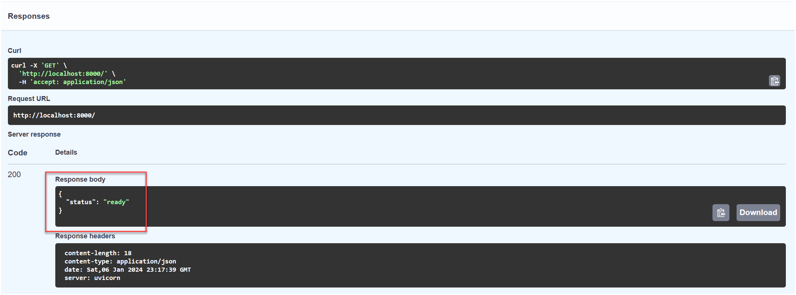

# Build Chatbot Backend

The backend api is a Node.js web application, using Express and Swagger, that will expose endpoints for the frontend application to interact with. The backend api could be deployed as web app on Azure App service.

## Run the backend api locally

When developing a backend api, it is often useful to run the application locally to test and debug. This section outlines how to run the backend api locally while watching the file system for code changes. Any detected changes will automatically restart the backend api.

1. Open the backend api folder location in VS Code: `apps/api`

2. Open a **Terminal** window in VS Code (<kbd>CTRL</kbd>+<kbd>`</kbd>).

3. Check `.env` file has correct configurations. Placeholder string should be all replaced in earlier `Lab Setup` step.

## Add LangChain Agent to Backend API

1. In the previous task, we created a LangChain agent that is capable of generating responses using RAG. Now, let's integrate this code into our Backend API service.

2. Compare `labs\03-LAB-03\5-Chatbot-Backend\agent.js` and `labs\03-LAB-03\5-Chatbot-Backend\langchain-agent.js`. You will notice that additional code has been added to the function to manage chat history.

   

3. The `agent.js` is used in `apps/api/bikestore/agent.js` to enable the backend to connect to both CosmosDb and OpenAI service.

4. Take your time and have a look at these files:
   - `apps\api\app.js` configures node.js app
   - `apps\api\swagger.js` configures swagger
   - `apps\api\bikestore\agent.js` contains Langchain agent logics


## Test out Backend API Swagger

1. Run the following command to install any dependencies:

   ```bash
   npm install
   ```

2. Run the following command to start the backend api.

   ```bash
   npm run dev
   ```

3. Open a browser and navigate to http://localhost:5000/docs to view the Swagger UI. If you are using `codespaces`, refer to the note below. In the newly opened browser, add `/docs` to the url in the address bar to open swagger interface.

   

   :::info
   If you are running the `codespaces` in web browser, please use the codespaces generated url. You shall see `Open in browser` button asking if you want to open the site in browser. If you missed the button, go to `PORTS` tab to find it. In the newly opened browser, add `/docs` to the url in the address bar to open swagger interface.

   The url would look similiar to: https://ominous-space-goldfish-v6vv749557wjfxj99-5000.app.github.dev/docs/

   Additionally, please also make the `Visibility` of the site to `Public` as shown in below screenshot. This is to allow frontend to access the API backend later.

   
   :::


4. Expand the **GET / Root** endpoint and select **Try it out**. Select **Execute** to send the request. The response should display a status of `ready`.

   

5. Expand the **POST /ai** endpoint and select **Try it out**. In the **Request body** field, enter the following JSON.

   ```json
   {
     "session_id": "abc123",
     "prompt": "hello, how are you"
   }
   ```

6. Select **Execute** to send the request. Observe that the response indicates the price as being `$1431.50`.

   

7. Please keep the backend running.
