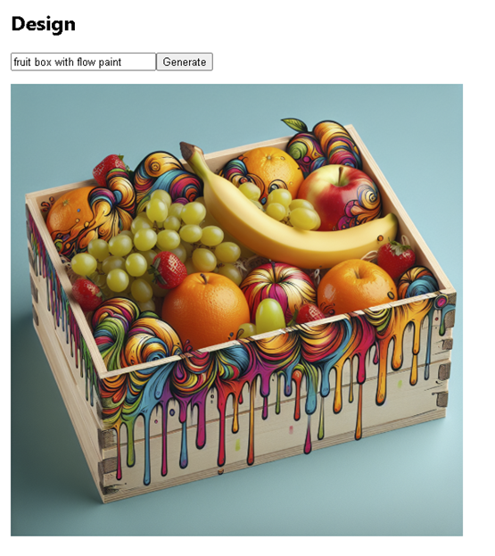

## Product Design

### Goal

Develop visually compelling designs that not only align with brand values but also enhance brand identity, ensuring they captivate customer interest and drive engagement.​

### Challenge

Elevate product design creativity by harnessing the power of DALL-e model to generate unique, high-quality artwork. This will facilitate concept development, streamline the brainstorming process, and inspire innovative design solutions that push creative boundaries.​



### Details

Use Dall-e model to create cretivity product design based on user's description.

There is a `Design` page (`apps\chatbot\pages\design\Design.tsx`) on chatbot. The page has an input textbox for description, and a button to call AI Service and get back a generated image.

Complete the `dalleApi` function to send a prompt and receive a generated image.

- Invoke dall-e endpoint using OpenAIClient
- Dall-e model's details are on the setup page
- Inspect and understand the response payload of the call
- Retrieve the generated image and display on the page


   :::info
   
   More things to think about

   - Secure the API key
   - Handle exception from Content Safety
   - Integrate the feature as a part of Chatbot

   :::


### Basic Solution


<details>
    <summary>Code snippet for above challenge</summary>
    <details>
    <summary>Don't Look! Have you tried to solve it yourself?</summary>
    <details>
    <summary>Your solution will be better than our sample answer!</summary>

    The basic solution is provided below. Feel free to expand on it to make it more interesting!

    ```

    import React, { useState } from "react";
    import { trackPromise } from "react-promise-tracker";
    import { usePromiseTracker } from "react-promise-tracker";
    import { OpenAIClient, AzureKeyCredential, Completions } from '@azure/openai';

    const Page = () => {

        const { promiseInProgress } = usePromiseTracker();
        const [imageText, setImageText] = useState<string>();
        const [imageUrl, setImageUrl] = useState<string>("");

        async function process() {
            if (imageText != null) {
                trackPromise(
                    dalleApi(imageText)
                ).then((res) => {
                    setImageUrl(res);
                }
                )
            }
        }

        async function dalleApi(prompt: string): Promise<string> {
            const options = {
                api_version: "2024-02-01"
            };
            const size = '1024x1024';
            const n = 1;
            
            var openai_url = "https://arg-syd-aiapp1day-openai.openai.azure.com";
            var openai_key = "<API_KEY>";
            const client = new OpenAIClient(
                openai_url,
                new AzureKeyCredential(openai_key),
                options
            );

            const deploymentName = 'dalle3';
            const result = await client.getImages(deploymentName, prompt, { n, size });
            console.log(result);

            if (result.data[0].url) {
                return result.data[0].url;
            } else {
                throw new Error("Image URL is undefined");
            }
        }

        const updateText = (e: React.ChangeEvent<HTMLInputElement>) => {
            setImageText(e.target.value);
        };

        return (
            <div className="pageContainer">
                <h2>Design</h2>
                <p></p>
                <p>
                    <input type="text" placeholder="(describe your design here)" onChange={updateText} />
                    <button onClick={() => process()}>Generate</button><br />
                    {
                        (promiseInProgress === true) ?
                            <span>Loading...</span>
                            :
                            null
                    }
                </p>
                <p>
                    
                </p>
            </div>
        );
    };

    export default Page;

    ```
    
    </details>
    </details>

</details>
