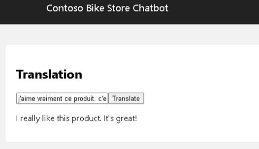

## Multilingual Use Review

### Goal

Extract meaningful and actionable insights from multilingual customer reviews to enhance product offerings and address quality concerns effectively.​

### Challenge

Leverage translation services and the GPT-4o model to interpret customer feedback across various languages, enabling efficient summarization and in-depth analysis for data-driven decision-making.​



### Tips

Create function that will take in a non-english customer review and translate it to English. 

There is a `Translation` page (`apps\chatbot\pages\translation\Translation.tsx`) on chatbot, the page have an input textbox for user review, and a button to invoke AI Service and get back translated review.

Complete the `translationApi` function to send a customer review in non-english and receive its english translation.

- Invoke Azure translation service using restful call
- Translation service's details are on the setup page
- Inspest the response payload of the the call
- Retrieve translated review and display on the page

### Solution

<details>

    <summary>Code snippet for above challenge</summary>

    <details>

    <summary>Don't Look! Have you tried to solve it yourself?</summary>

    ```
    import React, { useState } from "react";
    import { trackPromise } from "react-promise-tracker";
    import { usePromiseTracker } from "react-promise-tracker";

    const Page = () => {

        const { promiseInProgress } = usePromiseTracker();
        const [orginalText, setOriginalText] = useState<string>();
        const [translatedText, setTranslatedText] = useState<string>("");

        async function process() {
            if (orginalText != null) {
                trackPromise(
                    translationApi(orginalText)
                ).then((res) => {
                    setTranslatedText(res);
                }
                )
            }
        }

        async function translationApi(text: string): Promise<string> {

            const translation_url = `https://api.cognitive.microsofttranslator.com/translate?api-version=3.0&to=en&from=fr`;
            const translation_key = "7b61f16e4fbc4e58924a35da0a403937";

            const body =
                [{
                    "text": `${text}`
                }];

            const response = await fetch(translation_url, {
                method: "POST",
                headers: {
                    "Content-Type": "application/json",
                    "Ocp-Apim-Subscription-Region": "eastus",
                    "Ocp-Apim-Subscription-Key": translation_key,
                },
                body: JSON.stringify(body),
            });
            const data = await response.json();
            return data[0].translations[0].text;
        }

        const updateText = (e: React.ChangeEvent<HTMLInputElement>) => {
            setOriginalText(e.target.value);
        };

        return (
            <div className="pageContainer">
                <h2>Translation</h2>
                <p></p>
                <p>
                    <input type="text" placeholder="(enter review in original language)" onChange={updateText} />
                    <button onClick={() => process()}>Translate</button><br />
                    {
                        (promiseInProgress === true) ?
                            <span>Loading...</span>
                            :
                            null
                    }
                </p>
                <p>
                    {translatedText}
                </p>
            </div>
        );
    };

    export default Page;

    ```
    
    </details>

</details>