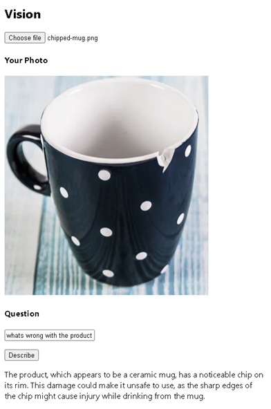

## Product Image Analysis

### Goal

Deliver a seamless and efficient customer service experience that enhances operational accuracy and accelerates processing times.​

### Challenge

Leveraging GPT-4o's vision capabilities for accurate analysis and verification of product photos. Reduces processing time but also ensures consistency and reliability in decision-making, ultimately enhancing the customer experience​



### Tips

Design a feature to utilise vision model to understand and extract information from image or photo.

There is a `Vision` page (`apps\chatbot\pages\vision\Vision.tsx`) on chatbot. The page has an image upload button to select a local image file, and a button to invoke AI Service and retrieve vision response.

Complete the `visionApi` function to send a user prompt together with a uploaded image, then receive the response that anlyzes certain features on the photo. The vision model will describe the content of the image.

- Invoke GPT-4o using OpenAIClient using `image_url` attribute
- GTP-4o's details are on the setup page
- Inspect the response payload of the call
- Retrieve the response and display on the page

   :::info
   
   More things to think about

   - Reference an image directly that is accessible on the internet
   - Define a system prompt that can be used as a template (i.e. product defect detection)

   :::

### Basic Solution


<details>
    <summary>Code snippet for above challenge</summary>
    <details>
    <summary>Don't Look! Have you tried to solve it yourself?</summary>
    <details>
    <summary>Your solution will be better than our sample answer!</summary>

    The basic solution is provided below. Feel free to expand on it to make it more interesting!

    ```

    import React, { useState } from "react";
    import { trackPromise } from "react-promise-tracker";
    import { usePromiseTracker } from "react-promise-tracker";
    import { OpenAIClient, AzureKeyCredential, Completions } from '@azure/openai';

    const Page = () => {

        const { promiseInProgress } = usePromiseTracker();
        const [selectedImage, setSelectedImage] = useState<File | null>(null);
        const [imageBase64, setimageBase64] = useState<string>("");
        const [imageText, setImageText] = useState<string>();
        const [imageDesc, setImageDesc] = useState<string>("");

        async function prcess() {
            if (imageText != null) {
                trackPromise(
                    visionApi(imageText, imageBase64)
                ).then((res) => {
                    setImageDesc(res);
                }
                )
            }
        }

        async function visionApi(text, image): Promise<string> {
            var messages =
                [
                    { "role": "system", "content": "You are a helpful assistant." },
                    {
                        "role": "user", "content": [
                            {
                                "type": "text",
                                "text": text
                            },
                            {
                                "type": "image_url",
                                "imageUrl": {
                                    "url": `${image}`
                                }
                            }
                        ]
                    }
                ];

            const options = {
                api_version: "2024-08-01-preview"
            };

            var openai_url = "https://arg-syd-aiapp1day-openai.openai.azure.com";
            var openai_key = "<API_KEY>";
            const client = new OpenAIClient(
                openai_url,
                new AzureKeyCredential(openai_key),
                options
            );
            // ?api-version=2023-12-01-preview
            const deploymentName = 'gpt4o';
            const result = await client.getChatCompletions(deploymentName, messages, {
                maxTokens: 200,
                temperature: 0.25
            });
            return result.choices[0]?.message?.content ?? '';
        }

        function getBase64(event) {
            let file = event.target.files[0];
            let reader = new FileReader();
            reader.readAsDataURL(file);
            reader.onload = function () {
                setimageBase64(reader.result);
            };
            reader.onerror = function (error) {
                console.log('Error: ', error);
            };
        }

        const updateText = (e: React.ChangeEvent<HTMLInputElement>) => {
            setImageText(e.target.value);
        };

        return (
            <div className="pageContainer">
                <h2>Vision</h2>

                <div>
                    <input
                        type="file"
                        name="myImage"
                        onChange={(event) => {
                            setSelectedImage(event.target.files[0]);
                            getBase64(event);
                        }}
                    />
                    <br />

                    {selectedImage && (
                        <div>
                            <h4>Your Photo</h4>
                            <p>
                                
                            </p>

                            <h4>Question</h4>
                            <input type="text" placeholder="(your question about the image)" onChange={updateText} />
                            <p>
                                <button onClick={() => prcess()}>Describe</button><br />
                                {
                                    (promiseInProgress === true) ?
                                        <span>Loading...</span>
                                        :
                                        null
                                }
                            </p>
                            <p>
                                {imageDesc}
                            </p>
                        </div>
                    )}
                </div>
            </div>
        );
    };

    export default Page;

    ```

    </details>
    </details>

</details>