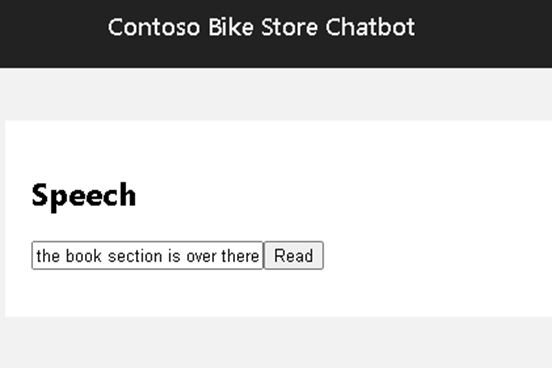

## Text-to-Speech for Self-service

### Goal

Enhance accessibility and ensure seamless communication across the store while providing a more natural and engaging store experience.​

### Challenge

Implement text-to-speech (TTS) to improve efficiency and self-service capabilities. Shoppers can receive product information, navigate the store, and stay updated on promotions through a more human-like and interactive experience - reducing reliance on staff while maintaining a personalized touch.



### Tips

Invoke Azure Speech service to read out text content in voice (text to speech).

There is a `Speech` page (`apps\chatbot\pages\speech\Speech.tsx`) on chatbot. The page has an input textbox for text content, and a button to invoke AI Service and play voice output.

Complete the `speechApi` function to send a text and receive a voice response.

- Invoke Speech service using Speech SDK
- Connect voice output to browser
- Play the voice in the browser

   :::info
   
   More things to think about

   - Implement speech to text to allow voice input
   - Integrate the feature as a part of Chatbot

   :::

### Basic Solution


<details>
    <summary>Code snippet for above challenge</summary>
    <details>
    <summary>Don't Look! Have you tried to solve it yourself?</summary>
    <details>
    <summary>Your solution will be better than our sample answer!</summary>

    The basic solution is provided below. Feel free to expand on it to make it more interesting!

    ```

    import React, { useState, useEffect } from "react";
    import { trackPromise } from "react-promise-tracker";
    import { usePromiseTracker } from "react-promise-tracker";
    import * as sdk from 'microsoft-cognitiveservices-speech-sdk';


    const Page = () => {

        const { promiseInProgress } = usePromiseTracker();
        const [speechText, setSpeechText] = useState<string>();
        const synthesizer = React.useRef(null);
        const speechConfig = React.useRef(null);

        useEffect(() => {
            const speech_key = '<API_KEY>';
            speechConfig.current = sdk.SpeechConfig.fromSubscription(
                speech_key,
                'eastus'
            );
            speechConfig.current.speechRecognitionLanguage = 'en-US';
            // speechConfig.current.speechSynthesisOutputFormat = 5;
            synthesizer.current = new sdk.SpeechSynthesizer(
                speechConfig.current
            );

        }, []);

        async function process() {
            if (speechText != null) {
                trackPromise(
                    speechApi(speechText)
                ).then((res) => {
                    setTranslatedText(res);
                }
                )
            }
        }

        async function speechApi(text: string): Promise<string> {
            await synthesizer.current.speakTextAsync(
                text,
                result => {
                    synthesizer.close();
                    const { audioData } = result;
                    // return stream from memory
                    const bufferStream = new PassThrough();
                    bufferStream.end(Buffer.from(audioData));
                    resolve(bufferStream);
                },
                error => {
                    synthesizer.close();
                    reject(error);
                });
        }

        const updateText = (e: React.ChangeEvent<HTMLInputElement>) => {
            setSpeechText(e.target.value);
        };

        return (
            <div className="pageContainer">
                <h2>Speech</h2>
                <p></p>
                <p>
                    <input type="text" placeholder="(enter some text to be read aloud)" onChange={updateText} />
                    <button onClick={() => process()}>Read</button><br />
                    {
                        (promiseInProgress === true) ?
                            <span>Loading...</span>
                            :
                            null
                    }
                </p>
            </div>
        );
    };

    export default Page;

    ```

    </details>
    </details>

</details>