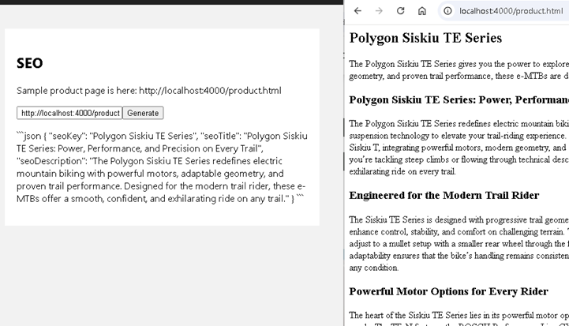

## SEO Content Generation​

### Goal

Increase website traffic and improve search engine rankings by leveraging SEO-optimised content customized for target audience.​

### Challenge

Automate the retrieval and creation of SEO-optimized content, incorporating relevant keywords, compelling titles, and effective meta tags to enhance online visibility and drive organic growth.​



### Tips

Write a function to read a web page and convert html to text and summariese it

There is a `SEO` page (`apps\chatbot\pages\seo\Seo.tsx`) on chatbot, the page have an input textbox for url, and a button to invoke AI Service and get back a generated SEO content.

Complete the `seoApi` function to send a website url and receive an SEO json.

- Use `axios` to retrieve html for a website
- Extract useful content from the html
- Define a few key SEO attribute you would like the LLM to summarise or generate
- Invoke LLM to get a structured JSON payload back for SEO
- Display the json on the page

### Solution

<details>

    <summary>Code snippet for above challenge</summary>

    <details>

    <summary>Don't Look! Have you tried to solve it yourself?</summary>

    ```

    import React, { useState } from "react";
    import { trackPromise } from "react-promise-tracker";
    import { usePromiseTracker } from "react-promise-tracker";
    import { OpenAIClient, AzureKeyCredential, Completions } from '@azure/openai';


    const Page = () => {
        const { promiseInProgress } = usePromiseTracker();
        const [seoUrl, setSeoUrl] = useState<string>();
        const [seoText, setSeoText] = useState<string>("");

        async function process() {
            if (seoUrl != null) {
                trackPromise(
                    seoApi(seoUrl)
                ).then((res) => {
                    setSeoText(res);
                }
                )
            }
        }

        async function seoApi(url): Promise<string> {
            const response = await fetch(url);
            const html = await response.text();
            console.log(html);

            var messages =
                [
                    { "role": "system", "content": "You are a helpful assistant that generate json data based on received xml. output must be json. actually generate the json, don't show me how." },
                    {
                        "role": "user", "content": [
                            {
                                "type": "text",
                                "text": "Analyse the provided html and summarise it as a json object containing the following fields  : seoKey, seoTitle, seoDescription. \r\n HTML content is here \r\n" + html
                            }
                        ]
                    }
                ];
            console.log(messages);

            const options = {
                api_version: "2024-08-01-preview"
            };

            var openai_url = "https://arg-syd-aiapp1day-openai.openai.azure.com";
            var openai_key = "e4e18d6e8fc44398b8571c9ba419bf84";
            const client = new OpenAIClient(
                openai_url,
                new AzureKeyCredential(openai_key),
                options
            );
            // ?api-version=2023-12-01-preview
            const deploymentName = 'gpt4o';
            const result = await client.getChatCompletions(deploymentName, messages, {
                maxTokens: 200,
                temperature: 0.25
            });
            return result.choices[0]?.message?.content ?? '';
        }

        const updateText = (e: React.ChangeEvent<HTMLInputElement>) => {
            setSeoUrl(e.target.value);
        };

        return (
            <div className="pageContainer">
                <h2>SEO</h2>
                <p>Sample product page is here: http://localhost:4000/product.html
                </p>
                <p>
                    <input type="text" placeholder="(enter url)" onChange={updateText} />
                    <button onClick={() => process()}>Generate</button><br />
                    {
                        (promiseInProgress === true) ?
                            <span>Loading...</span>
                            :
                            null
                    }
                </p>
                <p>
                    {seoText}
                </p>
            </div>
        );
    };

    export default Page;

    ```

    </details>

</details>