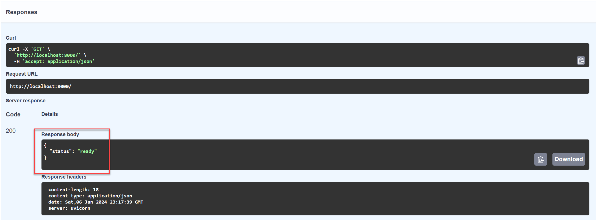
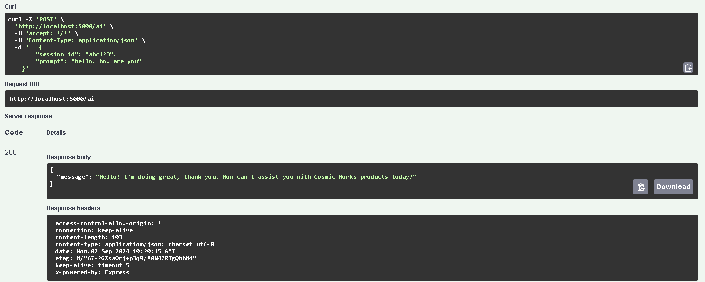

# Lab 1d - build a Backend API

The backend api is a Node.js web application, using Express and Swagger, that will expose endpoints for the frontend application to interact with. The backend api could be deployed as containerized application that will be deployed to [Azure Container Apps](https://learn.microsoft.com/en-us/azure/container-apps/overview) or Azure App service.

todo: need some coding work to be done. the current backend api uses langchain with RAG. we probably need to create a clean version of calling AOAI completion api directly in node js to demostrate a most simple version of invoking api. the users can test it out with swagger postman in browser.

## 1d.1 Clone the Backend API

Create a folder to house the repository. Open a terminal and navigate to the folder. Clone the repository, then navigate to the `Backend` folder within the repository.

```bash
git clone https://github.com/GitHub-Insight-ANZ-Lab/aiapp1day.git

cd apps
cd api
```

## 1d.2 Run the backend api locally

When developing a backend api, it is often useful to run the application locally to test and debug. This section outlines how to run the backend api locally while watching the file system for code changes. Any detected changes will automatically restart the backend api.

1. Open the backend api folder location in VS Code.

2. Open a **Terminal** window in VS Code (<kbd>CTRL</kbd>+<kbd>`</kbd>).

3. Setup the `.env` file. Copy the `.env.example` file to `.env` and update the values. These are the same environment variables used in the previous labs.

   ```bash
   cp .env.EXAMPLE .env
   ```

4. Add the following settings to the `.env` file, populating the MongoDB connection string and replacing the values from the deployed Azure OpenAI service:

   ```bash
   AZURE_OPENAI_API_INSTANCE_NAME=<openai-service-name>
   AZURE_OPENAI_API_KEY=<azure_openai_api_key>
   AZURE_OPENAI_API_DEPLOYMENT_NAME=completions
   AZURE_OPENAI_API_EMBEDDINGS_DEPLOYMENT_NAME=embeddings
   AZURE_OPENAI_API_VERSION=2023-09-01-preview
   ```

   Replace `<MONGODB_CONNECTION_STRING>` with the MongoDB connection string. Replace `<openai-service-name>` with the name of the deployed OpenAI service, and `<azure_openai_api_key>` with the Azure OpenAI API key. Leave all other values untouched.

   > **Note**: The Azure OpenAI service name is not the full endpoint. Only the service name is required. For example, if the endpoint is `https://myservicename.openai.azure.com/`, then the service name is `myservicename`.

5. Run the following command to install any dependencies:

   ```bash
   npm install
   ```

6. Run the following command to start the backend api.

   ```bash
   npm run dev
   ```

7. Open a browser and navigate to `http://localhost:5000/docs` to view the Swagger UI.

   

8. Expand the **GET / Root** endpoint and select **Try it out**. Select **Execute** to send the request. The response should display a status of `ready`.

   

9. Expand the **POST /ai** endpoint and select **Try it out**. In the **Request body** field, enter the following JSON.

   ```json
   {
     "session_id": "abc123",
     "prompt": "hello, how are you"
   }
   ```

10. Select **Execute** to send the request. Observe that the response indicates the price as being `$1431.50`.

    

11. In the Terminal window, press <kbd>CTRL</kbd>+<kbd>C</kbd> to stop the backend api.
