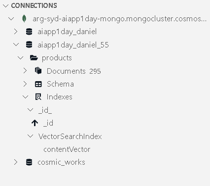

# Lab 2b - Create Embedding and vector search

This lab demonstrates using an Azure OpenAI embedding model to vectorize documents already stored in Azure Cosmos DB API for MongoDB, storing the embedding vectors and the creation of a vector index. The lab also demonstrates how to use the vector index to perform vector searches, and how to use the vector search results in a RAG (Retrieval Augmented Generation) pattern to generate a response from a large language model (LLM).

## 2b.1 Setup the lab environment

1. Open the `.env` file in the Visual Studio Code editor.

2. Add the following settings to the `.env` file, replacing the values from the deployed Azure OpenAI service. Please also copy `MONGODB_CONNECTION_STRING` and `MONGODB_Name` from previous lab.

    ```bash
    AZURE_OPENAI_API_INSTANCE_NAME=https://<openai-service-name>-openai.openai.azure.com/
    AZURE_OPENAI_API_KEY=<azure_openai_api_key>
    ```

    Replace `<openai-service-name>` with the name of the deployed OpenAI service, and `<azure_openai_api_key>` with the Azure OpenAI API key.

3. In Visual Studio Code, open a terminal window and navigate to the lab folder `lab_2b`.

4. Install the required packages by running the following command in the terminal window:

    ```bash
    npm install
    ```

## 2b.2 Create the Azure OpenAI client

1. Open the `embedding.js` file in the Visual Studio Code editor.

2. Beneath the line: `const { MongoClient } = require('mongodb');`, add the following code to import the Azure OpenAI client and Azure Key Credential classes:

    ```javascript
    const { OpenAIClient, AzureKeyCredential} = require("@azure/openai");
    ```

3. Beneath the code that sets up the MongoDB client, add the following code to create an instance of the Azure OpenAI client:

    ```javascript
    // set up the Azure OpenAI client 
    const embeddingsDeploymentName = "embeddings";
    const completionsDeploymentName = "completions";
    const aoaiClient = new OpenAIClient(process.env.AZURE_OPENAI_API_INSTANCE_NAME, 
                        new AzureKeyCredential(process.env.AZURE_OPENAI_API_KEY));
    ```


4. Install the `@azure/openai` package by running the following command in the terminal window. 

    ```bash
    npm install @azure/openai@1.0.0-beta.11 --save
    ```

5. This will install the package and save it as a dependency in your project's `package.json` file.
    


## 2b.3 Create a function to generate text embeddings

Vectorizing or embedding text is the process of converting text into a numerical representation. This guide has deployed an embedding model to Azure OpenAI, which can be used to generate embeddings for text. In this section, a function is introduced that uses the Azure OpenAI model to generate embeddings for text.

1. In `embedding.js`, add the following code directly above the last line of the file (that calls the `main` function):

    ```javascript
    async function generateEmbeddings(text) {
        const embeddings = await aoaiClient.getEmbeddings(embeddingsDeploymentName, text);
        // Rest period to avoid rate limiting on Azure OpenAI  
        await new Promise(resolve => setTimeout(resolve, 500));
        return embeddings.data[0].embedding;
    }
    ```

2. In the `main` function, beneath the `const db = dbClient.db(process.env.MONGODB_NAME);` line of code, add the following code to test the new `generateEmbeddings` function:

    ```javascript
    console.log(await generateEmbeddings("Hello, world!"));
    ```

3. Save the `embedding.js` file.

4. Run the application and observe the vector output in the console.

    ```bash
    node embedding.js
    ```

    

>**Question** Try a different input strimg and see if vector array length changes. Hmm, no matter how long the input string is, the return of creating embeddings with "text-embedding-ada-3" is always a vector of 1536. Why?
 
5. Remove the line of code from step 2.

6. Save the file.

## 2b.4 Vectorize and store the embeddings in each document

Now that the `generateEmbeddings` function is working, the next step is to use it to generate embeddings for each document and store the embeddings in a new field (contentVector) within the same document. The process of creating a vector embedding field on each document only needs to be done once. However, if a document changes, the vector embedding field will need to be updated with an updated vector.

In this section, a function is added that will loop through each document in a collection, generate the vector embedding, and store the vector embedding in the document itself. The function takes advantage of `bulkWrite` operations to perform upserts on the existing documents in an efficient way. Lastly, the function will create a vector index (VectorSearchIndex) on the collection to enable vector search queries if it does not already exist.

>**Note**: Generating embedding vectors for each document will take some time, exercise patience during this section until the process is complete.

1. In `vectorize.js`, add the following code directly above the last line of the file (that calls the `main` function) - the code is documented inline to explain the steps taken:

    ```javascript
    async function addCollectionContentVectorField(db, collectionName) {
        const collection = db.collection(collectionName); 
        const docs = await collection.find({}).toArray();
        const bulkOperations = [];
        console.log(`Generating content vectors for ${docs.length} documents in ${collectionName} collection`);
        for (let i=0; i<docs.length; i++) {
            const doc = docs[i];
            // do not include contentVector field in the content to be embedded
            if ('contentVector' in doc) {
                delete doc['contentVector'];
            }
            const content = JSON.stringify(doc);
            const contentVector = await generateEmbeddings(content);
            bulkOperations.push({
                updateOne: {
                    filter: { '_id': doc['_id'] },
                    update: { '$set': { 'contentVector': contentVector } },
                    upsert: true
                }
            });
            //output progress every 25 documents
            if ((i+1) % 25 === 0 || i === docs.length-1) {          
                console.log(`Generated ${i+1} content vectors of ${docs.length} in the ${collectionName} collection`);
            }
        }
        if (bulkOperations.length > 0) {
            console.log(`Persisting the generated content vectors in the ${collectionName} collection using bulkWrite upserts`);
            await collection.bulkWrite(bulkOperations);
            console.log(`Finished persisting the content vectors to the ${collectionName} collection`);
        }

        //check to see if the vector index already exists on the collection
        console.log(`Checking if vector index exists in the ${collectionName} collection`)
        const vectorIndexExists = await collection.indexExists('VectorSearchIndex');
        if (!vectorIndexExists) {
            await db.command({
                "createIndexes": collectionName,
                "indexes": [
                {
                    "name": "VectorSearchIndex",
                    "key": {
                    "contentVector": "cosmosSearch"
                    },
                    "cosmosSearchOptions": {                  
                    "kind": "vector-ivf",
                    "numLists": 1,
                    "similarity": "COS",
                    "dimensions": 1536
                    }
                }
                ]
            });
            console.log(`Created vector index on contentVector field on ${collectionName} collection`);
        }
        else {
            console.log(`Vector index already exists on contentVector field in the ${collectionName} collection`);
        }
    }
    ```

2. In the `main` function, beneath the `const db = dbClient.db(process.env.MONGODB_NAME);` line of code, add the following code to call the new `addCollectionContentVectorField` function on the `products` collection:

    ```javascript
    await addCollectionContentVectorField(db, 'products');
    ```

3. Save the `vectorize.js` file.

4. Run the application and observe the progress in the console.

    ```bash
    node vectorize.js
    ```

    

5. Lets have a look how the record in the database looks like especially the vector field and index.

    

6. Our vector index is created too.
   
    

7. Repeat steps 2-4 for the `customers` and `sales` collections by modifying the collection name in the `addCollectionContentVectorField` function call (each collection only needs to be vectorized once).

8. Once complete, remove all calls to the `addCollectionContentVectorField` function from the main function.

9.  Save the file.

## 2b.5 Use vector search

Now that each document has its associated vector embedding and the vector indexes have been created on each collection, we can now use the vector search capabilities of vCore-based Azure Cosmos DB for MongoDB. In this section, a function is added that will perform a vector search query that will return the most relevant documents based on the cosine similarity of the query vector and the content vectors of the documents in the collection.

1. In `search.js`, add the following code directly above the last line of the file (that calls the `main` function) - the code is documented inline to explain the steps taken. This code introduces two functions, one to perform a vector search and another to neatly print the search results:

    ```javascript
    async function vectorSearch(db, collectionName, query, numResults = 3) {
        const collection = db.collection(collectionName);
        // generate the embedding for incoming question
        const queryEmbedding = await generateEmbeddings(query);
        
        const pipeline = [
            {
                '$search': {
                    "cosmosSearch": {
                        "vector": queryEmbedding,
                        "path": "contentVector",
                        "k": numResults
                    },
                    "returnStoredSource": true
                }
            },
            { '$project': { 'similarityScore': { '$meta': 'searchScore' }, 'document': '$$ROOT' } }
        ];
        
        //perform vector search and return the results as an array
        const results = await collection.aggregate(pipeline).toArray();
        return results;
    }

    function printProductSearchResult(result) {  
        // Print the search result document in a readable format  
        console.log(`Similarity Score: ${result['similarityScore']}`);  
        console.log(`Name: ${result['document']['name']}`);  
        console.log(`Category: ${result['document']['categoryName']}`);  
        console.log(`SKU: ${result['document']['sku']}`);  
        console.log(`_id: ${result['document']['_id']}\n`);  
    }
    ```

2. In the `main` function, beneath the `const db = dbClient.db(process.env.MONGODB_NAME);` line of code, add the following code to test the new `vectorSearch` function:

    ```javascript
    //vector search for the top 3 most relevant products
    const searchResults = await vectorSearch(db, 'products', 'What products do you have that are yellow?');    
    searchResults.forEach(printProductSearchResult);
    ```

3. Save the `search.js` file.

4. Run the application and observe the search results in the console.

    ```bash
    node search.js
    ```

    

5. Delete the code added in step 2.

6. Save the file.

## 2b.6 Use vector search in a RAG (Retrieval Augmented Generation) pattern

In this section, a function is added that will use the vector search results to augment a prompt to a large language model (LLM). This is considered a RAG (Retrieval Augmented Generation) pattern. The function will use the vector search results to retrieve the most relevant documents and then use the unvectorized text of the retrieved documents to in the prompt to get an accurate response from the LLM.

1. In `rag.js`, add the following code directly above the last line of the file (that calls the `main` function) - the code is documented inline to explain the steps taken:

    ```javascript
    async function ragWithVectorsearch(db, collectionName, question, numResults=3) {
        //A system prompt describes the responsibilities, instructions, and persona of the AI.
        const systemPrompt = `
            You are a helpful, fun and friendly sales assistant for Contoso Bike Store, a bicycle and bicycle accessories store.
            Your name is Cosmo.
            You are designed to answer questions about the products that Contoso Bike Store sells.
            
            Only answer questions related to the information provided in the list of products below that are represented
            in JSON format.
            
            If you are asked a question that is not in the list, respond with "I don't know."
            
            List of products:
        `;
        const collection = db.collection(collectionName);
        //generate vector embeddings for the incoming question
        const queryEmbedding = await generateEmbeddings(question);
        //perform vector search and return the results
        results = await vectorSearch(db, collectionName, question, numResults);
        productList = "";
        //remove contentVector from the results, create a string of the results for the prompt
        for (const result of results) {
            delete result['document']['contentVector'];
            productList += JSON.stringify(result['document']) + "\n\n";
        }

        //assemble the prompt for the large language model (LLM)
        const formattedPrompt = systemPrompt + productList;
        //prepare messages for the LLM call, TODO: if message history is desired, add them to this messages array
        const messages = [
            {
                "role": "system",
                "content": formattedPrompt
            },
            {
                "role": "user",
                "content": question
            }
        ];

        //call the Azure OpenAI model to get the completion and return the response
        const completion = await aoaiClient.getChatCompletions(completionsDeploymentName, messages);
        return completion.choices[0].message.content;
    }
    ```

2. In the `main` function, beneath the `const db = dbClient.db(process.env.MONGODB_NAME);` line of code, add the following code to test the new `ragWithVectorsearch` function:

    ```javascript
    //RAG with vector search for the top 3 most relevant products
    console.log(await ragWithVectorsearch(db, 'products', 'What are the names and skus of some of the bikes you have?', 3));
    ```

3. Save the `rag.js` file.

4. Run the application and observe the response in the console.

    ```bash
    node rag.js
    ```

    

> **Challenge:** Are you interested in exploring the raw HTTP calls behind the scenes?

## Well Done!

In this lab, you have learned how to use an Azure OpenAI embedding model to vectorize documents already stored in Azure Cosmos DB API for MongoDB, store the embedding vectors, and create a vector index. You have also learned how to use the vector index to perform vector searches, and how to use the vector search results in a RAG (Retrieval Augmented Generation) pattern to generate a response from a large language model (LLM).
