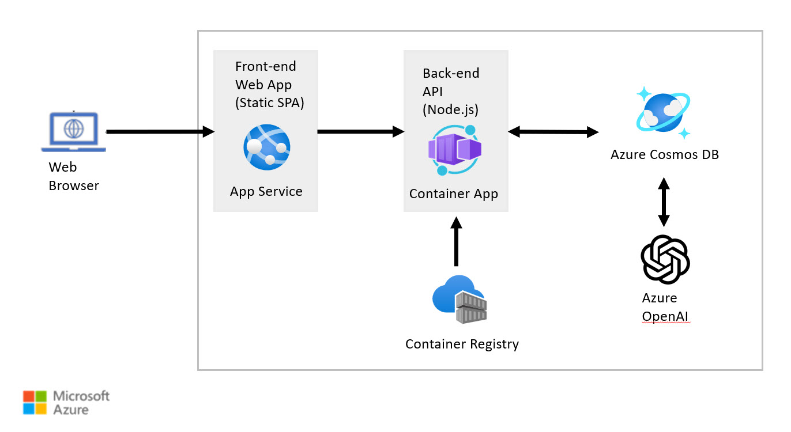

# Provision Azure resources (Azure Cosmos DB workspace, Azure OpenAI, etc.)

As the guide walks you through the concepts of integrating vCore-based Azure Cosmos DB for MongoDB and Azure OpenAI, the hands-on labs will also guide you through building a sample solution. The focus of this guide and the labs is limited to vCore-based Azure Cosmos DB for MongoDB, Vector Search, Azure OpenAI, and the Python programming language. With this focus, the labs include an Azure Bicep template that will deploy the following Azure resources the solution will be deployed to:

- Azure Resource Group
- vCore-based Azure Cosmos DB for MongoDB
- Azure OpenAI
  - ChatGPT-3.5 `completions` model
  - text-embedding-ada-002 model `embeddings` model
- Azure App Service - for hosting the front-end, static SPA web application written in React
- Azure Container App - for hosting the back-end, Node.js API application written in JavaScript
- Azure Container Registry - to host Docker images of backend, API application

## Architecture Diagram



Once the Azure resources are provisioned, this guide will walk you through everything that is necessary to build the Node.js Back-end API application.

The Front-end Web App is a static SPA application written in React. Since React is outside the scope of this guide, the Front-end Web App is pre-built for you and will be configured automatically on deployment. You do not need any experience with React in order to complete the labs in this guide.

## Lab - Provision Azure Resources

This lab will walk you through deploying the Azure resources necessary for the solution built in this guide. The deployment will be done using an Azure Bicep template that is configured to provision all the necessary resources.

> **Note**: You will need an Azure Subscription and have the necessary permissions to provision the Azure resources.

Please visit the lab repository to complete [this lab](https://github.com/AzureCosmosDB/Azure-OpenAI-Node.js-Developer-Guide/blob/main/Labs/deploy/deploy.md).


## Prerequisites

- Owner on Azure subscription
- Account approved for Azure OpenAI service
- Azure CLI installed
- Azure PowerShell installed

## Clone the repository

Create a folder to house the repository. Open a terminal and navigate to the folder. Clone the repository, then navigate to the `Labs/deploy` folder within the repository.

```bash
git clone https://github.com/AzureCosmosDB/Azure-OpenAI-Node.js-Developer-Guide.git

cd Azure-OpenAI-Node.js-Developer-Guide
cd Labs
cd deploy
```

Open the `azuredeploy.parameters.json` file, then edit the `mongoDbPassword` to a password you wish to use for the MongoDB Admin User:


When the Azure Bicep template is deployed, this parameters file will be used to configure the Mongo DB Password and other parameters when provisioning the Azure resources.

## Login to Azure

Open a terminal window and log in to Azure using the following command:

```Powershell
`Connect-AzAccount`
```

### Set the desired subscription (Optional)

If you have more than one subscription associated with your account, set the desired subscription using the following command:

```Powershell
Set-AzContext -SubscriptionId <subscription-id>
```

## Create resource group

```Powershell
New-AzResourceGroup -Name aiapp1day-rg -Location 'eastus'
```


## Deploy using bicep template

Deploy the solution resources using the following command (this will take a few minutes to run):

```Powershell
Install-Module -Name Bicep
```

```Powershell
New-AzResourceGroupDeployment -ResourceGroupName aiapp1day-rg -TemplateFile .\azuredeploy.bicep -TemplateParameterFile .\azuredeploy.parameters.json -c
```
